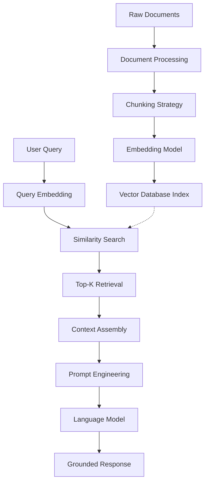

# Architecture 1: Standard RAG

Standard RAG represents the foundational paradigm in the Retrieval-Augmented Generation landscape. It serves as the baseline architecture against which all other advanced patterns are measured, establishing the core workflow of embedding-based retrieval combined with language model generation. This architecture treats retrieval as a simple, single-pass lookup operation, grounding language model outputs in externally stored vectorized content without requiring model fine-tuning or complex orchestration logic.

The paradigm shift introduced by Standard RAG is fundamental: it decouples knowledge storage from language model parameters, enabling organizations to leverage proprietary data without the prohibitive cost of training or fine-tuning models. Unlike base language models that generate responses based solely on training data weights, Standard RAG dynamically pulls relevant information at inference time, ensuring responses reflect current, organization-specific knowledge. This shift transforms language models from static knowledge repositories into dynamic information retrieval systems that can access any document corpus in real-time.

---

## Deep Dive: How It Works & Architecture Diagram

### Data Lifecycle

The Standard RAG pipeline executes through five distinct stages, each representing a critical transformation point in the data journey from raw documents to grounded responses.

**Ingestion Phase:** The system begins by ingesting raw documents from diverse sources—PDFs, Markdown files, HTML pages, or database exports. These documents undergo preprocessing that typically includes extraction of clean text, metadata preservation, and structure recognition. The preprocessing stage removes noise while retaining formatting hints that inform later chunking decisions.

**Chunking Phase:** Processed documents are split into smaller, semantically coherent text segments called "chunks." Chunking strategy profoundly impacts retrieval quality; too small and context is lost, too large and signal-to-noise ratio degrades. Common approaches include fixed-size windows with overlap, semantic chunking based on paragraph boundaries, or recursive splitting that respects document hierarchy. The chunk size typically ranges from 256 to 2048 tokens depending on the embedding model context window and use case.

**Embedding Phase:** Each chunk passes through an embedding model—typically dense models like text-embedding-3-small, sentence-transformers, or proprietary alternatives—which converts variable-length text into fixed-dimensional vectors (commonly 384, 768, or 1536 dimensions). These vectors capture semantic meaning in high-dimensional space, enabling similarity-based retrieval. The embedding model is chosen based on the trade-off between retrieval quality, latency, and cost.

**Storage Phase:** Embeddings are indexed in a vector database (Pinecone, Weaviate, Milvus, Qdrant, or pgvector) that supports efficient similarity search. The database maintains the mapping between vector representations and original text chunks, enabling retrieval of actual content once the most similar vectors are identified. Metadata indexing enables filtering by source, date, document type, or custom tags.

**Query Phase:** When a user submits a query, the same embedding model vectorizes the query text. The system performs a similarity search against the indexed chunks—typically using cosine similarity, dot product, or approximate nearest neighbor algorithms—to identify the top-K most semantically similar chunks. K typically ranges from 3 to 10 depending on chunk size and context window constraints.

**Generation Phase:** The retrieved chunks are concatenated with a carefully crafted prompt template that positions the retrieved context as the primary knowledge source. The prompt typically includes instructions directing the model to base its response exclusively on the provided context, cite specific chunks when making claims, and acknowledge uncertainty when context is insufficient. The augmented prompt flows to the language model, which generates a response grounded in the retrieved information.

### Architecture Diagram

```
┌─────────────────────────────────────────────────────────────────────────────┐
│                         STANDARD RAG ARCHITECTURE                           │
└─────────────────────────────────────────────────────────────────────────────┘

    ┌──────────┐     ┌──────────┐     ┌──────────┐     ┌──────────┐
    │ DOCUMENTS│────▶│ CHUNKING │────▶│ EMBEDDING│────▶│  VECTOR  │
    │ (PDF/DB) │     │ (Split)  │     │ (Model)  │     │   STORE  │
    └──────────┘     └──────────┘     └──────────┘     └─────┬────┘
                                                            │
                                                            ▼
    ┌──────────────────────────────────────────────────────────────┐
    │                      RETRIEVAL PIPELINE                      │
    │  ┌─────────────┐    ┌─────────────┐    ┌─────────────┐       │
    │  │    USER     │    │   EMBEDDING │    │  SIMILARITY │       │
    │  │   QUERY     │───▶│    QUERY    │───▶│   SEARCH    │       │
    │  └─────────────┘    └─────────────┘    └──────┬──────┘       │
    │                                                │              │
    │                                                ▼              │
    │                                      ┌─────────────────┐       │
    │                                      │   TOP-K CHUNKS  │       │
    │                                      │   (Ranked)      │       │
    │                                      └────────┬────────┘       │
    └───────────────────────────────────────────────┼───────────────┘
                                                    │
                                                    ▼
    ┌─────────────────────────────────────────────────────────────────┐
    │                    GENERATION PIPELINE                          │
    │  ┌─────────────────┐    ┌─────────────┐    ┌─────────────┐     │
    │  │  PROMPT TEMPLATE│    │    LLM      │    │   FINAL     │     │
    │  │ (Context + Query)│───▶│ (GPT-4/4o)  │───▶│  RESPONSE   │     │
    │  └─────────────────┘    └─────────────┘    └─────────────┘     │
    └─────────────────────────────────────────────────────────────────┘
```

### Mermaid Diagram Alternative



---

## Real & Practical Production Example

### User Input Query

> "What is our company's policy on remote work eligibility and what equipment allowances are provided?"

### System's Internal Processing

**Step 1 - Query Embedding:** The user query passes through the embedding model (e.g., text-embedding-3-small), producing a 1536-dimensional vector. This vector represents the semantic intent: understanding remote work eligibility requirements and equipment-related financial benefits.

**Step 2 - Similarity Search:** The vector database executes a nearest neighbor search against the indexed HR policy documents. Suppose the chunking strategy produced 500-character chunks with 50-character overlap from the employee handbook. The search identifies the following top-5 matching chunks with similarity scores:

- Chunk 1 (Score: 0.89): "All full-time employees who have completed their probationary period are eligible for remote work arrangements. Remote work eligibility requires manager approval and completion of the remote work agreement form."
- Chunk 2 (Score: 0.85): "Employees designated as remote-eligible are provided with a one-time equipment allowance of $1,500 for a laptop, monitor, keyboard, and mouse. Additional requests require manager approval."
- Chunk 3 (Score: 0.78): "Remote work employees must maintain a dedicated workspace that meets ergonomic standards. The company provides an ergonomic assessment at no cost."
- Chunk 4 (Score: 0.72): "The remote work policy is reviewed annually. Current policy effective date: January 1, 2024."
- Chunk 5 (Score: 0.68): "VPN access and security training are required for all remote workers. IT provides 24/7 support for remote connectivity issues."

**Step 3 - Context Assembly:** The system concatenates these chunks into a context window, respecting the model's context length limits. For a 128K context window model with 4K allocated for output, approximately 120K tokens remain for context—comfortably容纳 the top chunks plus the prompt template.

**Step 4 - Generation:** The prompt instructs the model to synthesize the retrieved information into a clear, structured response. The resulting output:

> "Based on the employee handbook, remote work eligibility applies to all full-time employees who have completed their probationary period. You must obtain manager approval and complete the remote work agreement form.
>
> Regarding equipment allowances, eligible remote employees receive a one-time allowance of $1,500 for laptop, monitor, keyboard, and mouse purchases. Additional equipment requires manager approval.
>
> Additional notes: Remote workers must maintain an ergonomic workspace (the company offers free ergonomic assessments), and VPN access with completed security training is mandatory. The policy is reviewed annually, with the current version effective since January 1, 2024."

### Why This Architecture Handled The Query Successfully

Standard RAG succeeded here because the query was straightforward, the information existed in a single document with clear semantic signals, and the retrieval was precise enough to surface the relevant chunks. The architecture works when the semantic gap between query and answer is narrow—when the user asks something that directly matches content in the knowledge base.

---

## Real-World Industry Application

### Industry Sector: Internal Enterprise Knowledge Management

Standard RAG powers internal employee assist systems in mid-sized enterprises (50-500 employees) where the knowledge base is relatively static and queries are predominantly factual lookups. Organizations like startups, professional services firms, and departmental teams within larger enterprises deploy this pattern for HR policy answers, IT troubleshooting guides, internal procedure documentation, and onboarding materials.

**Specific Production System Environment:** A healthcare technology company's internal knowledge base serving 200+ employees across engineering, sales, and operations teams. The system indexes Confluence pages, Google Docs, PDFs of technical specifications, and Jira knowledge base articles. The RAG pipeline runs on AWS Lambda with Pinecone for vector storage, GPT-4o-mini for generation, and operates as a Slack-integrated chatbot accessible to all employees during business hours. The system handles approximately 500 queries per day with a 95% success rate for factual lookups.

---

## Proper Justification & ROI

### Technical Justification

Standard RAG is the correct choice when **query complexity is low**, **data freshness requirements are moderate** (daily or weekly updates acceptable), **latency budget is under 2 seconds**, and **the primary failure mode is hallucination from lack of grounding** rather than retrieval failures. This architecture delivers the maximum ROI for the lowest engineering investment, making it the logical starting point for any RAG implementation.

The economics favor Standard RAG because retrieval and generation costs scale linearly with query volume. At approximately $0.001-0.005 per query (using embedding models like text-embedding-3-small and generation models like GPT-4o-mini), the operational cost remains predictable and manageable. Compare this to Self-RAG, which can cost 5-10x more per query due to multiple generation passes and reflection token processing.

### Business Case

**Cost Comparison (Monthly 10,000 queries):**

- Standard RAG: ~$50-150/month for embedding + generation + vector storage
- Conversational RAG: ~$80-200/month (adds query rewriting overhead)
- Agentic RAG: ~$500-2000/month (multi-step orchestration, multiple API calls)
- Self-RAG: ~$250-500/month (requires fine-tuned models, multiple passes)

**ROI Break-Even:** If the alternative to RAG is human-mediated knowledge search (employee spending 5 minutes on average to find internal information), Standard RAG saves approximately 833 hours per month (10,000 queries × 5 minutes), translating to significant productivity gains even at modest hourly rates.

### Point of Diminishing Returns

Standard RAG reaches its performance ceiling when you observe these failure patterns:

- **Semantic mismatch failures:** Users phrase questions differently than document content is written, causing retrieval to miss relevant chunks despite the information existing
- **Multi-part query failures:** Questions requiring synthesis across multiple documents fail because the single retrieval pass cannot gather enough context
- **Confidence calibration failures:** The system cannot distinguish between high-quality and low-quality retrieval, leading to confident-sounding but incorrect answers

At this point, adding memory (Conversational RAG), query expansion (Fusion RAG), or verification layers (Corrective RAG) provides incremental improvement—but each addition adds latency and cost.

---

## Recommended Technology Stack

### Embedding Layer

- **Primary:** OpenAI text-embedding-3-small (1536 dimensions, $0.02/1M tokens) or text-embedding-3-large (3072 dimensions, $0.13/1M tokens) for higher quality retrieval
- **Alternative:** Cohere embed-multilingual-v3.0 for multilingual corpora, or sentence-transformers/all-MiniLM-L6-v2 for self-hosted deployment
- **Self-hosted option:** BGE-base-en-v1.5 deployed on CPU inference for data-sensitive applications

### Vector Database

- **Cloud-managed:** Pinecone (serverless, automatic scaling), Weaviate (open-source with cloud options), or Qdrant (Rust-based, high performance)
- **Self-hosted:** Milvus for large-scale deployments, pgvector for existing PostgreSQL infrastructure, or Chroma for prototyping
- **Key selection criteria:** Hybrid search capability (vector + filtering), latency under 50ms for 10M+ vectors, and managed index rebuilds

### Language Model

- **Production standard:** GPT-4o-mini or GPT-4o for balanced cost/quality, Claude 3 Haiku for highest latency-sensitive workloads
- **Self-hosted:** Llama 3 8B instruct with vLLM inference for cost-sensitive deployments requiring data privacy
- **Prompt engineering:** Custom instructions for citation behavior, uncertainty acknowledgment, and format control

### Orchestration (Minimal)

- **Framework:** LangChain LCEL for prompt chaining, or raw API calls for simpler implementations
- **No heavy orchestration needed:** Standard RAG does not require agentic frameworks; simple function composition suffices

---

## Production Blindspots & Guardrails

### Blindspot 1: Retrieval Quality Degradation Without Monitoring

**Failure Mode:** Over time, the embedding space degrades as new documents are added that don't match the distribution of initial training data. Query performance silently drops because chunk relevance scores decline, but no alerts fire since absolute similarity scores are not monitored. Users receive increasingly irrelevant results without the system indicating failure.

**Guardrail - Retrieval Quality Metrics:** Implement continuous monitoring of:
- Mean reciprocal rank (MRR) on a golden query set
- Chunk relevance scores on sampled queries (alert when average top-1 score drops below 0.7)
- Query-to-result semantic similarity tracking with drift detection

### Blindspot 2: Chunk Boundary Context Loss

**Failure Mode:** When a query requires information that spans multiple chunks—such as "What are the eligibility requirements AND the equipment allowance?"—retrieval may fetch separate chunks that individually contain partial answers but lack the connective context. The model assembles a response that is factually correct per chunk but semantically incomplete or internally inconsistent.

**Guardrail - Hierarchical Chunking:** Implement overlap-based chunking with metadata linking:
- Use 30% overlap between chunks to preserve cross-boundary context
- Store chunk adjacency metadata enabling retrieval of neighboring chunks when relevant
- Implement parent-child chunking: retrieve child chunks for precise matching, then fetch parent chunks for broader context

### Blindspot 3: Prompt Injection Through Retrieved Content

**Failure Mode:** Adversarial or accidentally malicious content in the knowledge base gets retrieved and processed by the language model. Since the model treats retrieved content as authoritative context, injected instructions in source documents can influence model behavior in ways that bypass system prompts.

**Guardrail - Input Sanitization Layer:**
- Scan all ingested documents for suspicious patterns (excessive system prompt keywords, unusual encoding, hidden instructions)
- Implement document provenance tracking enabling quarantine of compromised sources
- Add a sanitization step before context assembly that strips or escapes potentially dangerous tokens
- Rate-limit retrieval from documents flagged as untrusted

### Blindspot 4: Context Window饱和

**Failure Mode:** When the knowledge base grows or chunk sizes increase, the retrieved top-K chunks may approach or exceed the model's context window capacity. The system may truncate prompts, drop retrieved chunks, or exceed token limits, resulting in incomplete context and degraded response quality.

**Guardrail - Context Budget Management:**
- Implement strict token budgeting that reserves 20% of context window for output generation
- Use dynamic chunk sizing based on query complexity (smaller chunks for simple factual queries, larger for complex synthesis)
- Add fallback logic that progressively reduces K when approaching token limits

---

## Summary

Standard RAG is the foundational architecture that enables organizations to ground language models in proprietary knowledge without model fine-tuning. Its strength lies in operational simplicity, predictable costs, and sufficient performance for low-complexity retrieval tasks. The architecture excels when queries map directly to document content, latency requirements are strict, and the primary failure mode is hallucination rather than retrieval complexity. However, its susceptibility to semantic mismatch, inability to handle multi-document synthesis, and lack of self-correction mechanisms define its boundaries. All advanced RAG architectures build upon this foundation, adding capabilities that address Standard RAG's specific failure modes.

**Decision Guideline:** Start with Standard RAG. Only add complexity when measurement proves it fails on your specific query patterns. The sophistication of your architecture should match the measured difficulty of your retrieval problems, not the theoretical complexity of available solutions.