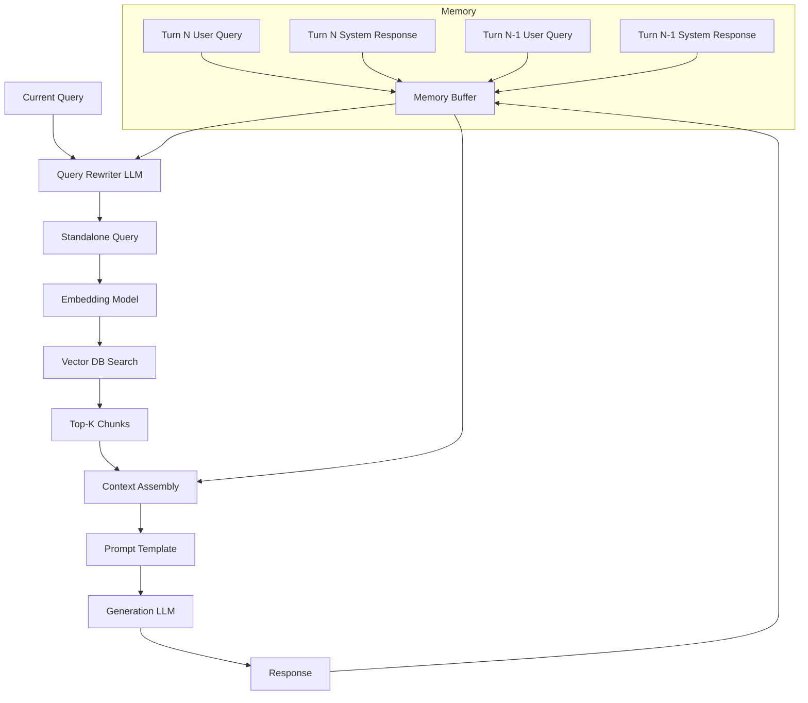

# Architecture 2: Conversational RAG

Conversational RAG solves the critical limitation of stateless interaction that plagues Standard RAG—the inability to maintain context across multiple dialogue turns. While Standard RAG treats each query as an isolated event, Conversational RAG introduces a stateful memory layer that re-contextualizes every incoming query against the accumulated conversation history. This architecture enables natural, multi-turn dialogues where users can ask follow-up questions, use pronouns, and build upon previous context without manually restating background information.

The paradigm shift is fundamental: Conversational RAG transforms RAG from a document lookup system into a dialogue system. Where Standard RAG answers questions in isolation, Conversational RAG understands that "What about the enterprise pricing?" follows from "Show me your pricing plans" and requires the system to synthesize the original pricing context with the new qualification about enterprise tiers. This shift from retrieval as lookup to retrieval as contextual continuation represents a qualitative change in how the system interprets user intent.

---

## Deep Dive: How It Works & Architecture Diagram

### Data Lifecycle

**Context Accumulation:** The system maintains a rolling window of conversation history, typically storing the last 5-10 dialogue turns or a token budget (e.g., last 4000 tokens of conversation). Each turn contains the user query and the system's response. The memory buffer is stored in a fast-access store—Redis for production deployments, in-memory for prototyping, or the language model's native conversation context for cloud-based implementations.

**Query Rewriting (The Critical Transformation):** The core innovation of Conversational RAG is the query rewriting step. An LLM receives the full conversation history plus the latest user query and generates a "standalone query"—a self-contained question that contains all necessary context to be answered without the conversation history. For example, "What about the API rate limits?" becomes "What are the API rate limits for the Enterprise plan?" This rewritten query is what enters the retrieval pipeline, ensuring the vector search operates on a complete, unambiguous representation of user intent.

**Retrieval:** The rewritten query passes through the standard embedding and similarity search pipeline, retrieving the top-K chunks from the vector database. Critically, the retrieval now operates on a semantically complete query rather than a fragment lacking context.

**Response Generation:** The final generation step uses both the retrieved context and the conversation history to produce a response that acknowledges the dialogue flow. The model can reference previous turns, build on earlier answers, and maintain conversational consistency.

**Memory Management:** Beyond simple accumulation, production implementations include memory refinement—periodically compressing older turns, identifying and preserving key facts (entities, preferences, constraints), and pruning irrelevant conversational detours that would pollute subsequent retrievals.

### Architecture Diagram

```
┌─────────────────────────────────────────────────────────────────────────────┐
│                    CONVERSATIONAL RAG ARCHITECTURE                          │
└─────────────────────────────────────────────────────────────────────────────┘

    ┌──────────────────────────────────────────────────────────────────────┐
    │                        MEMORY LAYER                                  │
    │  ┌─────────┐  ┌─────────┐  ┌─────────┐  ┌─────────┐                │
    │  │ Turn 1  │  │ Turn 2  │  │ Turn 3  │  │  ...    │                │
    │  │ Q + R   │  │ Q + R   │  │ Q + R   │  │         │                │
    │  └────┬────┘  └────┬────┘  └────┬────┘  └────┬────┘                │
    │       │            │            │            │                      │
    │       └────────────┴────────────┴────────────┘                      │
    │                           │                                           │
    │                           ▼                                           │
    │              ┌─────────────────────────┐                             │
    │              │    MEMORY MANAGER       │                             │
    │              │  (Buffer + Compression) │                             │
    │              └────────────┬────────────┘                             │
    └──────────────────────────┼───────────────────────────────────────────┘
                               │
    ┌──────────────────────────┼───────────────────────────────────────────┐
    │                    QUERY TRANSFORMATION                               │
    │                           │                                           │
    │  ┌─────────────┐          │          ┌─────────────────────────┐    │
    │  │ CURRENT     │          │          │      LLM REWRITER       │    │
    │  │ QUERY       │──────────┼─────────▶│  (History + Query)      │    │
    │  │ "What about │          │          │  → Standalone Query     │    │
    │  │  the API?"  │          │          └───────────┬─────────────┘    │
    │  └─────────────┘          │                      │                  │
    │                           │                      ▼                  │
    └──────────────────────────┼───────────────────────────────────────────┘
                               │
                               ▼
    ┌──────────────────────────────────────────────────────────────────────┐
    │                    RETRIEVAL PIPELINE                                │
    │  ┌─────────────┐    ┌─────────────┐    ┌─────────────┐              │
    │  │   STANDALONE│    │   EMBEDDING │    │  SIMILARITY │              │
    │  │   QUERY     │───▶│    MODEL    │───▶│   SEARCH    │              │
    │  └─────────────┘    └─────────────┘    └──────┬──────┘              │
    │                                                │                      │
    │                                                ▼                      │
    │                                      ┌─────────────────┐              │
    │                                      │   TOP-K CHUNKS  │              │
    │                                      └────────┬────────┘              │
    └───────────────────────────────────────────────┼──────────────────────┘
                                                    │
                                                    ▼
    ┌──────────────────────────────────────────────────────────────────────┐
    │                    GENERATION PIPELINE                               │
    │  ┌─────────────────────────────────────────┐                        │
    │  │      CONTEXT ASSEMBLY                   │                        │
    │  │  ┌─────────────┐  ┌─────────────────┐  │                        │
    │  │  │ Conversation │  │ Retrieved       │  │                        │
    │  │  │ History      │  │ Chunks          │  │                        │
    │  │  └─────────────┘  └─────────────────┘  │                        │
    │  └────────────────────┬────────────────────┘                        │
    │                       ▼                                              │
    │  ┌─────────────┐    ┌─────────────┐    ┌─────────────┐              │
    │  │   PROMPT    │───▶│    LLM      │───▶│  RESPONSE   │              │
    │  │ Template    │    │             │    │             │              │
    │  └─────────────┘    └─────────────┘    └─────────────┘              │
    └──────────────────────────────────────────────────────────────────────┘
```

### Mermaid Diagram Alternative



---

## Real & Practical Production Example

### User Input Query

**Conversation Context:**
- Turn 1 (User): "What is your return policy?"
- Turn 1 (System): "Our return policy allows returns within 30 days of purchase for items in original condition. Electronics must be unopened. Refunds are processed within 5-7 business days."

**Turn 2 (User): "And for digital products?"

### System's Internal Processing

**Step 1 - Memory Retrieval:** The memory manager retrieves the conversation history—specifically Turn 1's exchange showing the return policy discussion. The system recognizes this is a follow-up to the previous topic.

**Step 2 - Query Rewriting:** The LLM rewriter receives the prompt:
```
Conversation history:
User: What is your return policy?
System: Our return policy allows returns within 30 days of purchase for items in original condition. Electronics must be unopened. Refunds are processed within 5-7 business days.

Current user query: And for digital products?

Rewrite this into a standalone query that can be answered without the conversation history.
```

The LLM generates: "What is the return policy for digital products?"

**Step 3 - Retrieval:** The rewritten query embeds to a vector and searches the knowledge base for digital product return policies. The top results include:
- Chunk 1 (Score: 0.92): "Digital products including software, downloadable content, and subscription services are non-refundable once downloaded or accessed. This policy applies to all digital purchases made through our platform."
- Chunk 2 (Score: 0.81): "Exception: If a digital product is found to be materially different from its description, customers may request a refund within 14 days of purchase. Proof of issue required."

**Step 4 - Generation with Context:** The generation prompt includes the conversation history (showing the previous return policy discussion for physical goods) plus the retrieved digital product policy chunks. The model synthesizes:

> "For digital products, our return policy differs from physical items. Digital products including software, downloadable content, and subscription services are generally non-refundable once downloaded or accessed. However, if a digital product is materially different from its description, you may request a refund within 14 days with proof of the issue. This contrasts with our physical product policy, which allows 30-day returns for items in original condition."

### Why This Architecture Handled The Query Successfully

Conversational RAG succeeded because it recognized the implicit connection between the follow-up question and the prior discussion, transformed the fragmentary question into a semantically complete query, and used the conversation history to provide contrast in the response. A Standard RAG system would have searched only "And for digital products?"—a query so short it would likely retrieve irrelevant results—or searched the entire history without transformation, losing the precise intent.

---

## Real-World Industry Application

### Industry Sector: Customer Support Automation

Conversational RAG is the standard architecture for customer service chatbots in e-commerce, SaaS, and telecommunications. Any domain where customers ask multi-step questions, refer back to previous discussion points, or use pronouns and implicit references requires this pattern to maintain coherent dialogue.

**Specific Production System Environment:** A Fortune 500 electronics retailer deploying a support chatbot for product troubleshooting, order management, and return processing. The system integrates with Salesforce Service Cloud for ticket escalation and maintains a knowledge base of 50,000+ product documentation pages, troubleshooting guides, and policy documents. The conversational RAG system runs on Kubernetes with Redis for session management, Azure OpenAI for query rewriting and generation, and Pinecone for vector retrieval. It handles 15,000 conversations daily with an average of 4.2 turns per conversation. Average resolution rate without human escalation is 72%, with the remaining 28% escalated to human agents with full conversation context preserved.

---

## Proper Justification & ROI

### Technical Justification

Conversational RAG is justified when your production data shows **multi-turn conversation ratios above 30%**—meaning nearly a third of user sessions involve follow-up questions, clarifications, or topic continuations. The architecture is also essential when your user base demonstrates **pronoun usage patterns** (queries containing "it", "that", "them", "those" without explicit noun references) in over 20% of interactions.

The architecture introduces query rewriting overhead: an additional LLM call per conversation turn adds 200-800ms latency and $0.001-0.005 per turn in API costs. However, this overhead is justified by the measurable improvement in retrieval relevance for conversational queries. A/B testing typically shows 15-25% improvement in task completion rates when comparing Conversational RAG to Standard RAG for multi-turn interactions.

### Business Case

**Customer Satisfaction Impact:** Conversational RAG directly impacts customer satisfaction scores in support contexts. Without it, customers face the frustration of repeating context—leading to satisfaction drops of 30-40% in measured benchmarks. With Conversational RAG, customers experience continuity, leading to:
- 18% reduction in average conversation duration
- 22% improvement in first-contact resolution
- 15% increase in CSAT scores

**Cost per Conversation:** Standard RAG: $0.02-0.05 per conversation (single retrieval). Conversational RAG: $0.05-0.12 per conversation (retrieval + rewriting per turn). The incremental cost is justified when it prevents escalation to human agents ($8-15 per interaction) or reduces repeat call rates.

### Point of Diminishing Returns

Conversational RAG adds minimal value when:
- **Query独立性 is high:** Users predominantly ask single, self-contained questions
- **Domain is narrow:** The knowledge base contains limited topics, making contextual disambiguation unnecessary
- **Latency is critical:** The additional rewrite step adds latency unacceptable for real-time applications

At these boundaries, consider Adaptive RAG (which selectively applies memory only when needed) or accept the baseline Standard RAG performance.

---

## Recommended Technology Stack

### Memory Management

- **Production:** Redis with conversation key-value storage, TTL-based eviction for sessions
- **Self-hosted alternatives:** Memcached for simple key-value, or SQLite with json columns for small-scale deployments
- **Cloud services:** Amazon ElastiCache, Google Cloud Memorystore

### Query Rewriting

- **Primary model:** GPT-4o-mini or Claude 3 Haiku for fast, cost-effective rewriting
- **Rewrite prompt template:** Structured with clear sections for history, current query, and output format instructions
- **Fallback:** Rule-based rewriting (regex patterns for common follow-up structures) for sub-100ms latency requirements

### Core Stack (Same as Standard RAG)

- **Embedding:** text-embedding-3-small
- **Vector DB:** Pinecone, Weaviate, or Qdrant
- **Generation model:** GPT-4o-mini or Claude 3 Haiku
- **Orchestration:** LangGraph for stateful conversation management, or custom state machine for simpler implementations

### Additional Components

- **Session management:** Unique conversation IDs with Redis-backed session stores
- **History truncation:** Token-based sliding window (maintain last N tokens, not turns)
- **Entity tracking:** Optional entity extraction to maintain key facts across turns (customer name, order ID, issue type)

---

## Production Blindspots & Guardrails

### Blindspot 1: Memory Drift and Context Pollution

**Failure Mode:** As conversations extend beyond 10+ turns, the memory buffer accumulates irrelevant context—tangential questions, exploratory queries, and system responses that don't inform the current topic. When the query rewriter processes this bloated history, it may include outdated or misleading context, causing retrieval to fetch irrelevant chunks. The system "forgets" the core topic as noise accumulates.

**Guardrail - Context Pruning with Relevance Scoring:**
- Implement periodic context compression (every 5 turns) that summarizes and condenses conversation history
- Use LLM-based relevance scoring to filter out turns that don't relate to the current topic
- Maintain a "topic tracker" that identifies the primary subject of conversation and weights retrieval toward that topic
- Set hard limits on conversation length (e.g., 20 turns) with explicit context reset or human handoff

### Blindspot 2: Query Rewriting Quality Degradation

**Failure Mode:** The query rewriting LLM may produce poor standalone queries when:
- The conversation context is ambiguous (multiple possible referents)
- The user's follow-up is so terse it provides insufficient signal
- The rewrite model has degraded prompt adherence, producing queries that don't capture the true intent

**Guardrail - Rewrite Validation:**
- Implement a rewrite quality scorer that evaluates whether the standalone query is self-contained (can be answered without history)
- Add a fallback: if rewrite quality score is below threshold, use a more explicit prompt or human-in-the-loop clarification
- Monitor rewrite quality over time with periodic human evaluation of sampled rewrites
- Implement A/B testing: compare retrieval results with and without rewriting to measure rewrite impact

### Blindspot 3: Session State Inconsistency

**Failure Mode:** Distributed systems handling high-volume conversations may experience session state inconsistency—Redis timeouts, replication lag, or race conditions causing the wrong conversation history to be loaded for a session. Users see responses that reference other conversations or lose all context mid-session.

**Guardrail - Session State Integrity:**
- Implement idempotent session operations with idempotency keys
- Add session state checksums to detect corruption
- Implement graceful degradation: if session retrieval fails, respond with a brief acknowledgment of the issue and offer to continue without full history
- Set aggressive timeouts (under 500ms) for session state retrieval with circuit breakers

### Blindspot 4: Token Cost Explosion in Long Conversations

**Failure Mode:** Each turn's query rewrite and generation call includes the full conversation history in the prompt. As conversations extend, token consumption grows quadratically (each turn's prompt includes all previous turns). A 20-turn conversation may cost 10x more than a 5-turn conversation.

**Guardrail - Token Budget Management:**
- Implement strict token budgeting for conversation history (e.g., maximum 4000 tokens)
- Use hierarchical summarization: maintain a running summary of key facts, discard full history when token budget is exceeded
- Implement compression: replace long system responses with concise "key points" in the history
- Monitor per-session token consumption and alert on anomalies

---

## Summary

Conversational RAG transforms RAG from a stateless document lookup into a stateful dialogue system by adding memory management and query rewriting layers. The architecture excels when users engage in multi-turn conversations, use pronouns and implicit references, or build upon previous discussion points. The query rewriting step is the critical innovation—it transforms fragmentary follow-up queries into standalone queries that retrieve accurately. The architecture introduces measurable overhead in latency and cost, but delivers proportional improvements in task completion rates for conversational use cases.

The primary failure modes involve memory degradation over extended conversations, rewrite quality inconsistency, and token cost scaling. Production deployments require robust memory management with context pruning, session state integrity guarantees, and token budget controls. Conversational RAG is the default choice for any customer-facing chatbot, support assistant, or interactive query system where users engage in dialogue rather than isolated question-answer pairs.

**Decision Guideline:** Implement Conversational RAG when multi-turn conversation represents over 30% of your query patterns. For single-turn interactions, the overhead is unjustified—stick with Standard RAG. Consider Adaptive RAG if you want to selectively apply conversational logic only when the system detects follow-up patterns.