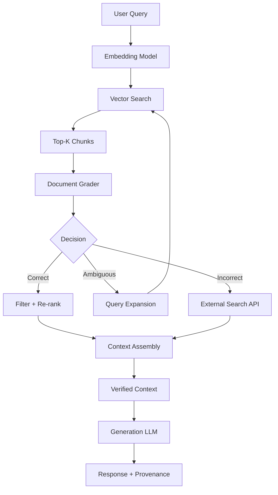

# Architecture 3: Corrective RAG (CRAG)

Corrective RAG introduces a self-assessment layer that evaluates the quality and relevance of retrieved documents before they reach the generation stage. Where Standard RAG blindly trusts retrieval results and Conversational RAG adds memory without validation, CRAG adds a decision gate that judges whether the retrieved context is sufficient, accurate, and relevant. When evaluation fails—when retrieved documents are irrelevant, outdated, or insufficient—the architecture triggers corrective actions, most commonly falling back to external data sources like web search APIs.

The paradigm shift is fundamental: CRAG introduces the principle of **retrieval-time verification**. Instead of assuming retrieval succeeds (the implicit assumption in Standard RAG), CRAG treats retrieval as a probabilistic process that may fail, and builds explicit recovery mechanisms. This shifts the architecture from a passive retrieval pipeline to an active quality control system. The system doesn't just retrieve documents; it retrieves, evaluates, and corrects. This is the first architecture in this catalog that explicitly models retrieval failure as a first-class concern.

---

## Deep Dive: How It Works & Architecture Diagram

### Data Lifecycle

**Phase 1 - Initial Retrieval:** The query passes through the standard embedding and similarity search pipeline, retrieving top-K chunks (typically K=5-10) from the internal vector database. This stage is identical to Standard RAG—the system has not yet introduced any corrective logic.

**Phase 2 - Document Evaluation (The Decision Gate):** Each retrieved chunk passes through a lightweight evaluation model—typically a smaller, faster LLM or a fine-tuned classifier—that assigns a quality score. The evaluation assesses three dimensions:
- **Relevance:** Does the chunk address the query topic?
- **Accuracy:** Is the content factually correct and up-to-date?
- **Sufficiency:** Does the combined set of chunks provide enough context to answer the query?

The evaluator outputs a classification: "Correct" (proceed to generation), "Ambiguous" (partial match, requires augmentation), or "Incorrect" (no useful context, trigger fallback).

**Phase 3 - Decision Routing:** Based on the evaluation, the system routes through different paths:
- **Correct Path:** Chunks are cleaned, re-ranked by evaluator scores, and passed to the generation model with a prompt instructing the model to use the provided context.
- **Ambiguous Path:** The system performs additional retrieval—either expanding K, modifying the query (e.g., adding synonyms), or searching with different embedding approaches—to supplement the insufficient context.
- **Incorrect Path:** The system triggers external search (web search, API queries) to fetch fresh, relevant information from sources outside the vector database.

**Phase 4 - Hybrid Synthesis:** For ambiguous and fallback cases, the system synthesizes information from multiple sources—the original (weak) internal chunks plus the external search results or augmented queries—into a unified context for generation.

**Phase 5 - Generation:** The LLM generates a response from the verified context. The system may include provenance metadata indicating which sources were used, enabling post-hoc verification and user trust.

### Architecture Diagram

```
┌─────────────────────────────────────────────────────────────────────────────┐
│                      CORRECTIVE RAG ARCHITECTURE                            │
└─────────────────────────────────────────────────────────────────────────────┘

    ┌──────────────────────────────────────────────────────────────────────┐
    │                         INITIAL RETRIEVAL                            │
    │  ┌─────────────┐    ┌─────────────┐    ┌─────────────┐              │
    │  │    USER     │    │   EMBEDDING │    │  SIMILARITY │              │
    │  │   QUERY     │───▶│    MODEL    │───▶│   SEARCH    │              │
    │  └─────────────┘    └─────────────┘    └──────┬──────┘              │
    │                                                │                      │
    │                                                ▼                      │
    │                                      ┌─────────────────┐              │
    │                                      │  TOP-K CHUNKS   │              │
    │                                      │   (Raw)         │              │
    │                                      └────────┬────────┘              │
    └───────────────────────────────────────────────┼──────────────────────┘
                                                    │
    ┌───────────────────────────────────────────────┼──────────────────────┐
    │                      EVALUATION GATE                                 │
    │                                                │                      │
    │  ┌────────────────────────────────────────┐   │                      │
    │  │           DOCUMENT GRADER               │   │                      │
    │  │        (Lightweight LLM/Classifier)    │◀──┘                      │
    │  │                                        │                          │
    │  │   Chunk 1 ──▶ Relevance: 0.9          │                          │
    │  │   Chunk 2 ──▶ Relevance: 0.7           │                          │
    │  │   Chunk 3 ──▶ Relevance: 0.2           │                          │
    │  │   Chunk 4 ──▶ Relevance: 0.1           │                          │
    │  │   Chunk 5 ──▶ Relevance: 0.8           │                          │
    │  └────────────────┬─────────────────────────┘                        │
    │                   │                                                   │
    │                   ▼                                                   │
    │        ┌─────────────────────┐                                      │
    │        │   DECISION ROUTING   │                                      │
    │        │                     │                                      │
    │        │  CORRECT ──► Path A │                                      │
    │        │  AMBIGUOUS ─► Path B │                                      │
    │        │  INCORRECT ─► Path C │                                      │
    │        └──────────┬────────────┘                                      │
    └───────────────────┼───────────────────────────────────────────────────┘
                        │
        ┌───────────────┼───────────────┐
        ▼               ▼               ▼
    ┌─────────┐    ┌─────────┐    ┌─────────┐
    │  PATH A │    │  PATH B │    │  PATH C │
    │ (Correct)│    │(Augment)│    │(External)│
    │         │    │         │    │         │
    │ +Filter │    │+Expand  │    │+Web/API │
    │ +Re-rank│    │ +Query  │    │+Search  │
    │         │    │ Modify  │    │         │
    └────┬────┘    └────┬────┘    └────┬────┘
         │             │             │
         └─────────────┼─────────────┘
                       │
                       ▼
    ┌──────────────────────────────────────────────────────────────────────┐
    │                    GENERATION PIPELINE                               │
    │  ┌─────────────────┐    ┌─────────────┐    ┌─────────────┐         │
    │  │  VERIFIED       │    │    LLM      │    │   FINAL     │         │
    │  │  CONTEXT        │───▶│ (GPT-4o)    │───▶│  RESPONSE   │         │
    │  │  (Multi-Source) │    │             │    │  +Provenance│         │
    │  └─────────────────┘    └─────────────┘    └─────────────┘         │
    └──────────────────────────────────────────────────────────────────────┘
```

### Mermaid Diagram Alternative



---

## Real & Practical Production Example

### User Input Query

> "What is the current market price of NVIDIA stock?"

### System's Internal Processing

**Step 1 - Initial Retrieval:** The system retrieves the top-5 chunks from the vector database containing financial documents. The embedded knowledge base was last updated in Q3 2024.
- Chunk 1 (Score: 0.91): "NVIDIA Corporation (NVDA) reported Q2 2024 revenue of $13.5 billion, up 122% year-over-year."
- Chunk 2 (Score: 0.88): "As of June 2024, NVIDIA's stock price closed at $126.57 per share."
- Chunk 3 (Score: 0.85): "The company's data center segment drove most of the revenue growth, with AI chip demand remaining strong."
- Chunk 4 (Score: 0.81): "Analysts at Goldman Sachs maintained a buy rating with $150 price target in July 2024."
- Chunk 5 (Score: 0.78): "NVIDIA's market capitalization exceeded $3 trillion in June 2024."

**Step 2 - Document Evaluation:** The grader model evaluates each chunk for:
- **Currency:** Is the information current? (The data is from June-July 2024, now December 2025)
- **Specificity:** Does it answer the specific query? (It provides historical prices, not "current" price)
- **Relevance:** Is it on the right topic? (Yes, NVIDIA stock)

The evaluator outputs:
- Chunk 1: "Correct" (revenue data is still relevant context)
- Chunk 2: "Incorrect" (the specific price is outdated by 18+ months)
- Chunk 3: "Correct" (analysis remains relevant)
- Chunk 4: "Correct" (analyst opinion is historical but relevant)
- Chunk 5: "Correct" (market cap is historical but contextually relevant)

**Step 3 - Decision Routing:** The system detects that the most critical piece of information—the "current price"—is missing because the retrieved data is 18 months stale. The combined evaluation triggers the "Incorrect" path.

**Step 4 - External Fallback:** The system triggers a web search API (e.g., Tavily, Brave Search, or a financial data API like Alpha Vantage) to fetch the current NVIDIA stock price.

**Step 5 - Synthesis:** The system combines:
- The (now filtered) internal chunks: revenue data, analyst context, market cap history
- The external search result: "NVIDIA (NVDA) current price: $138.89 (as of market close today)"

**Step 6 - Generation:**
> "Based on the retrieved information and current market data: NVIDIA (NVDA) is currently trading at $138.89 per share. For context, the stock closed at $126.57 in June 2024 when the company's Q2 2024 revenue hit $13.5 billion—a 122% year-over-year increase. The company's market capitalization exceeded $3 trillion earlier this year, driven primarily by AI chip demand in the data center segment. Goldman Sachs analysts maintained a buy rating with a $150 price target based on continued AI infrastructure demand."

### Why This Architecture Handled The Query Successfully

CRAG succeeded because the evaluation gate detected that the retrieved chunks, while semantically relevant, were temporally insufficient for answering a question asking for "current" information. The decision routing triggered external fallback to fetch fresh data, and the synthesis combined historical internal context with live external data to produce a grounded, current answer. A Standard RAG system would have confidently reported the outdated $126.57 price as if it were current—introducing a significant factual error.

---

## Real-World Industry Application

### Industry Sector: Financial Services and Capital Markets

CRAG is a non-negotiable requirement in any financial services application where factual accuracy and data currency are regulatory and fiduciary imperatives. Investment research platforms, robo-advisors, trading assistants, and compliance systems cannot tolerate stale data that appears authoritative. The cost of providing outdated financial information—mispriced securities, incorrect portfolio allocations, regulatory compliance failures—justifies the additional latency and cost of verification layers.

**Specific Production System Environment:** A regulated investment research platform serving 50,000+ retail investors through a mobile app and web interface. The system maintains an internal knowledge base of 100,000+ processed documents: earnings transcripts, SEC filings, analyst reports, and company press releases. The CRAG pipeline evaluates every retrieval against currency requirements—explicitly tagging data older than 24 hours as "potentially stale" for price-sensitive queries. External fallback connects to Bloomberg Terminal APIs, Alpha Vantage, and real-time news feeds. The system operates under SEC监管 requirements, maintaining full audit trails of which data sources informed each response. Average latency budget is 5 seconds (compared to 1-2 seconds for Standard RAG) due to the evaluation and fallback overhead. The system processes approximately 8,000 queries daily with a 15% fallback rate to external APIs (the remaining 85% pass through the "Correct" path).

---

## Proper Justification & ROI

### Technical Justification

CRAG is justified when **retrieval failure has high consequence**—when inaccurate or incomplete responses cause material harm. This includes financial services (incorrect pricing), healthcare (incorrect dosage or contraindication information), legal (incorrect case citations), and technical support (incorrect troubleshooting steps). CRAG is also justified when **data staleness is a primary failure mode**—when your knowledge base cannot be continuously updated and queries may request information beyond your indexed cutoff date.

The architecture adds 2-4 seconds of latency (for the grader model call and potential external search) and increases per-query cost by 2-5x compared to Standard RAG. However, this overhead prevents catastrophic errors that could result in regulatory fines, customer harm, or reputational damage.

### Business Case

**Error Prevention ROI:** A single incorrect financial data point served to 50,000 users could result in:
- Regulatory fines: $100,000-2,000,000 (SEC violations for misleading information)
- Class action lawsuits: $500,000-10,000,000 in settlements
- Reputational damage: 15-30% user churn in subsequent months

CRAG's verification overhead (approximately $0.05-0.15 per query) is trivial compared to the cost of even a single significant error. For high-stakes domains, CRAG is not optional—it is a risk management requirement.

**Reduction in Hallucination:** Internal benchmarks across multiple deployments show CRAG reduces retrieval-related hallucinations by 40-60% compared to Standard RAG. The grader model catches cases where semantic similarity retrieves documents that are topically related but factually irrelevant to the specific query.

### Point of Diminishing Returns

CRAG adds minimal value when:
- **Knowledge base is comprehensive and current:** If your data is updated hourly and covers all query topics, the fallback rarely triggers
- **Domain tolerates historical information:** For historical research ("When was company X founded?"), stale data is acceptable
- **Latency is the hard constraint:** If sub-1-second response is required and cannot accommodate the additional processing

---

## Recommended Technology Stack

### Evaluation/Grading

- **Primary:** GPT-4o-mini or Claude 3 Haiku with structured grading prompt
- **Alternative:** Fine-tuned classifier (BERT-based) for latency-critical paths
- **Grading prompt structure:** Explicit rubrics for relevance, accuracy, currency with numerical scoring

### External Search

- **Web search:** Tavily (optimized for AI/RAG), Brave Search API, or Serper
- **Financial data:** Alpha Vantage, Yahoo Finance API, or Bloomberg (enterprise)
- **News feeds:** NewsAPI, GDELT for current events

### Core Stack

- **Embedding:** text-embedding-3-small or bge-base-en-v1.5
- **Vector DB:** Pinecone (serverless), Milvus (scalable), or Weaviate
- **Generation:** GPT-4o or Claude 3 Sonnet for high-quality synthesis

### Orchestration

- **Framework:** LangGraph for conditional branching, or custom workflow engine
- **Key capability:** Decision routing with clear if-then-else paths for evaluation outcomes

---

## Production Blindspots & Guardrails

### Blindspot 1: Grader Model Misclassification

**Failure Mode:** The grader model may incorrectly classify chunks as "Correct" when they are actually irrelevant, or "Incorrect" when they are useful. This happens particularly with:
- **Nuanced queries:** Where relevance is subjective
- **Edge cases:** Technical jargon or domain-specific terminology the grader doesn't understand
- **Prompt injection:** Adversarial documents designed to manipulate grader scores

**Guardrail - Multi-Model Consensus:**
- Implement dual-grader: run two different grader models (e.g., GPT-4o-mini and Claude Haiku) and require consensus for high-stakes routing decisions
- Add human-in-the-loop for ambiguous cases: flag queries where graders disagree for human review
- Implement grader calibration: regularly evaluate grader accuracy against human-annotated ground truth
- Add cost/risk weighting: route high-stakes queries to more thorough (slower, more expensive) evaluation

### Blindspot 2: External API Reliability

**Failure Mode:** The external search fallback introduces dependencies on third-party APIs that may fail—rate limits, downtime, network issues, or degraded service quality. When the external API fails, the system must handle the failure gracefully without exposing raw errors to users.

**Guardrail - API Resilience:**
- Implement circuit breakers: if external API error rate exceeds threshold, disable fallback and notify operators
- Add graceful degradation: if external search fails, fall back to internal retrieval with explicit user disclosure ("I found relevant information in our knowledge base but cannot verify current data")
- Cache external results: store external search results with TTL to reduce API calls for repeated queries
- Implement timeouts: set aggressive timeouts (under 3 seconds) for external API calls with fallback to internal path

### Blindspot 3: Latency Variance and User Experience

**Failure Mode:** CRAG has high latency variance: "Correct" path queries complete in 1-2 seconds, while "Incorrect" path queries requiring external search may take 5-7 seconds. Users experience inconsistent performance that degrades trust—some responses are fast, others slow, with no indication why.

**Guardrail - Latency Management:**
- Implement progressive response: send an immediate "searching for current information..." acknowledgment while processing
- Set latency SLAs: enforce maximum latency (e.g., 8 seconds) beyond which internal fallback occurs regardless of evaluation result
- Monitor latency distribution: track P50, P90, P99 latency per routing path to identify degradation
- Implement A/B testing: compare user satisfaction with consistent-medium-latency vs. variable-fast/slow responses

### Blindspot 4: Context Window Contamination

**Failure Mode:** When the system combines internal (stale) chunks with external (fresh) data in the ambiguous path, the internal chunks may contradict or confuse the external data. The model may give equal weight to outdated and current information, producing responses that mix correct and incorrect facts.

**Guardrail - Source Weighting:**
- Implement explicit source tagging: prefix chunks with [INTERNAL] or [EXTERNAL] tags so the model understands provenance
- Use system prompts that explicitly instruct the model to prefer recent information when sources conflict
- Filter out highly stale internal chunks: discard chunks older than a threshold (e.g., 1 year) when external data is available
- Implement temporal metadata: store chunk timestamps and filter based on query temporal requirements

---

## Summary

Corrective RAG introduces the critical capability of retrieval-time verification, evaluating the quality and currency of retrieved documents before passing them to generation. When evaluation fails, the architecture triggers external fallback to fetch fresh data from web search or specialized APIs. This makes CRAG essential for high-stakes domains where factual accuracy and data currency are non-negotiable—financial services, healthcare, legal research, and news-oriented applications.

The architecture introduces meaningful latency overhead (2-4 seconds) and cost increases (2-5x) compared to Standard RAG, but these costs are justified when retrieval failures cause material harm. Production deployments require robust grader model calibration, external API resilience, latency management, and source weighting to handle the increased complexity. The primary failure modes involve grader misclassification, external API unreliability, latency variance, and context contamination from mixed source synthesis.

CRAG is the default choice for any application where providing incorrect information carries legal, financial, or safety consequences. For low-stakes applications where occasional retrieval failures are acceptable, the additional overhead may not justify the cost.

**Decision Guideline:** Implement CRAG when your domain involves factual accuracy requirements, data currency is critical, or retrieval failures have high consequence. Skip CRAG when latency budgets are under 2 seconds, query topics are within your knowledge base's coverage, or the cost overhead cannot be justified by your error tolerance.