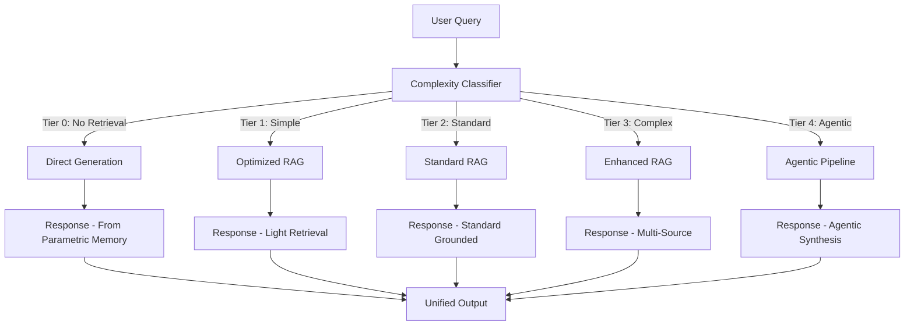

# Architecture 4: Adaptive RAG

Adaptive RAG introduces intelligent routing that dynamically selects the appropriate processing path based on query complexity. Rather than applying the same retrieval and generation strategy to every query—as Standard RAG does by default, or as Conversational RAG does with fixed memory addition—Adaptive RAG uses a classifier to assess each query's difficulty and routes it through the most cost-effective path. Simple factual queries skip retrieval entirely and rely on the model's parametric knowledge; complex analytical queries trigger multi-step retrieval and synthesis; straightforward lookups use standard retrieval without conversational overhead.

The paradigm shift is fundamental: Adaptive RAG introduces **query-aware resource allocation**. Instead of applying maximum effort (full retrieval + generation) to every query—wasting resources on trivial questions—it matches computational investment to query complexity. This is the first architecture that explicitly models the trade-off between query complexity and computational cost, treating the routing decision as a first-order engineering problem. The system becomes an efficient allocator of AI resources rather than a uniform pipeline.

---

## Deep Dive: How It Works & Architecture Diagram

### Data Lifecycle

**Phase 1 - Complexity Analysis:** Every incoming query passes through a classifier—a lightweight model (fine-tuned classifier, embedding-based similarity to query archetypes, or rule-based heuristics) that categorizes the query into one of several complexity tiers. Common tiers include:
- **Tier 0 - No Retrieval Needed:** Greetings, general knowledge ("What is Python?"), or model instructions ("Write a poem")
- **Tier 1 - Simple Lookup:** Single factual question with clear answer in knowledge base ("What is our return policy?")
- **Tier 2 - Standard RAG:** Question requiring retrieved context but single-step ("Explain our pricing plans")
- **Tier 3 - Multi-Step Retrieval:** Complex question requiring multiple searches, cross-referencing, or iterative refinement ("Compare our pricing to Competitor X over the last 3 years")
- **Tier 4 - Agentic:** Highly complex queries requiring planning, multiple tool calls, and synthesized multi-source responses

**Phase 2 - Path Routing:** The classifier's output determines the execution path:
- **Path 0 (No Retrieval):** Query goes directly to generation without any retrieval step. The model answers from its training data. This path has zero retrieval cost and minimum latency (typically under 500ms).
- **Path 1 (Optimized Retrieval):** Query goes through standard retrieval but with reduced K (top-2-3 chunks instead of top-5-10) and a lighter generation model. This path balances speed and grounding.
- **Path 2 (Standard RAG):** Full Standard RAG pipeline—top-K retrieval, full context, standard generation model. This is the baseline path.
- **Path 3 (Enhanced Retrieval):** Uses advanced retrieval techniques—query expansion, reranking, or multiple retrieval passes—before generation.
- **Path 4 (Agentic):** Full agentic pipeline with planning, tool orchestration, and multi-step execution.

**Phase 3 - Adaptive Response:** The generation step adapts its output style based on the path. Responses from Path 0 may include more hedging language ("Based on my training..."). Responses from Path 4 include explicit citation of sources with reasoning traces.

### Architecture Diagram

```
┌─────────────────────────────────────────────────────────────────────────────┐
│                       ADAPTIVE RAG ARCHITECTURE                            │
└─────────────────────────────────────────────────────────────────────────────┘

    ┌──────────────────────────────────────────────────────────────────────┐
    │                      QUERY COMPLEXITY CLASSIFIER                     │
    │                                                                          │
    │   ┌─────────────┐                                                    │
    │   │    USER     │                                                    │
    │   │   QUERY     │                                                    │
    │   └──────┬──────┘                                                    │
    │          │                                                            │
    │          ▼                                                            │
    │   ┌─────────────────────────┐                                        │
    │   │   COMPLEXITY ANALYZER   │                                        │
    │   │                         │                                        │
    │   │  ┌──────────────────┐   │                                        │
    │   │  │ Embedded Query   │   │                                        │
    │   │  │ vs. Complexity   │   │                                        │
    │   │  │ Archetypes       │   │                                        │
    │   │  └────────┬─────────┘   │                                        │
    │   │           │             │                                        │
    │   │           ▼             │                                        │
    │   │  ┌──────────────────┐   │                                        │
    │   │  │ Rule-Based + LLM  │   │                                        │
    │   │  │ Classification    │   │                                        │
    │   │  └────────┬─────────┘   │                                        │
    │   │           │             │                                        │
    │   └───────────┼─────────────┘                                        │
    │               │                                                       │
    └───────────────┼───────────────────────────────────────────────────────┘
                    │
    ┌───────────────┼───────────────────────────────────────────────────────┐
    │                    PATH ROUTING                                        │
    │               │                                                       │
    │    ┌──────────┼──────────┬──────────┬──────────┐                    │
    │    │          │          │          │          │                    │
    │    ▼          ▼          ▼          ▼          ▼                    │
    │ ┌──────┐  ┌──────┐  ┌──────┐  ┌──────┐  ┌──────┐                  │
    │ │Path 0│  │Path 1│  │Path 2│  │Path 3│  │Path 4│                  │
    │ │No    │  │Optim. │  │Std   │  │Enh.  │  │Agentic│                  │
    │ │Retrieval│  │RAG   │  │RAG   │  │RAG   │  │      │                  │
    │ └──────┘  └──────┘  └──────┘  └──────┘  └──────┘                  │
    │    │          │          │          │          │                    │
    │    │          │          │          │          │                    │
    │    ▼          ▼          ▼          ▼          ▼                    │
    │ ┌──────┐  ┌──────┐  ┌──────┐  ┌──────┐  ┌──────┐                  │
    │ │Direct│  │Fast  │  │Full  │  │Multi │  │Multi │                  │
    │ │Gen   │  │Embed │  │RAG   │  │Step  │  │Agent │                  │
    │ │      │  │+Light│  │      │  │Search│  │Orch. │                  │
    │ └──────┘  └──────┘  └──────┘  └──────┘  └──────┘                  │
    │    │          │          │          │          │                    │
    └────┼──────────┼──────────┼──────────┼──────────┼────────────────────┘
         │          │          │          │          │
         └──────────┴──────────┴──────────┴──────────┘
                          │
                          ▼
    ┌──────────────────────────────────────────────────────────────────────┐
    │                    UNIFIED RESPONSE                                   │
    │  (Response calibrated to complexity, with source attribution where   │
    │   retrieval was used)                                               │
    └──────────────────────────────────────────────────────────────────────┘
```

### Mermaid Diagram Alternative



---

## Real & Practical Production Example

### User Input Query

> "Hello"

### System's Internal Processing

**Step 1 - Complexity Analysis:** The classifier evaluates "Hello" against complexity archetypes:
- **Token count:** 1 (extremely short)
- **Semantic content:** Greeting, no substantive topic
- **Intent markers:** None of the complexity indicators (comparison, multi-part, temporal, analytical)
- **Embedding proximity:** Closest match to "greeting" archetype (similarity 0.94)

**Step 2 - Routing Decision:** The classifier assigns Tier 0 ("No Retrieval Needed").

**Step 3 - Path Execution:** The query bypasses retrieval entirely and goes directly to generation with a polite greeting prompt. The generation model uses only its parametric knowledge—no retrieval cost, no embedding API calls.

**Step 4 - Response:**
> "Hello! How can I help you today?"

### Alternative Query

> "Compare our cloud storage pricing with Google's for business customers"

### System's Internal Processing

**Step 1 - Complexity Analysis:** The classifier evaluates the query:
- **Comparison requested:** "Compare...with..."
- **Multi-entity:** "our cloud storage" vs "Google's"
- **Domain qualifier:** "for business customers"
- **No temporal qualifier detected, but "pricing" implies current data needed
- **Classification:** Tier 3 ("Enhanced RAG" - requires multi-step retrieval)

**Step 2 - Routing Decision:** Route to Path 3 (Enhanced RAG).

**Step 3 - Path Execution:**
- Retrieval Pass 1: Search for company's cloud storage pricing (business tier)
- Retrieval Pass 2: Search for Google Cloud Storage pricing (business tier)
- Retrieval Pass 3: Search for comparison or competitive analysis documents
- Synthesis: Combine results and generate comparative analysis

**Step 4 - Response:**
> "Here's a comparison of cloud storage pricing for business customers:

> **Your Company's Pricing:**
> - Starter Business: $15/user/month (includes 1TB)
> - Enterprise: Custom pricing, includes unlimited storage
> - Per-GB overage: $0.008/GB/month

> **Google Cloud Storage:**
> - Standard Storage: $0.020/GB/month (regional)
> - Nearline: $0.010/GB/month (accessed <1x/month)
> - Archive: $0.004/GB/month (accessed <1x/year)
> - Enterprise: Custom negotiated rates

> **Key Finding:** Your company's pricing is approximately 60% lower than Google's standard regional storage for comparable tiers..."

### Why This Architecture Handled The Queries Successfully

Adaptive RAG succeeded because it applied appropriate effort levels to each query. The "Hello" greeting received instant response (under 300ms) with zero wasted resources. The pricing comparison triggered the comprehensive pipeline that performed multiple retrieval passes and cross-referenced sources. A uniform pipeline would have either wasted resources on the greeting or under-processed the comparison—either failing to find the comparative data or returning incomplete results.

---

## Real-World Industry Application

### Industry Sector: Consumer SaaS and E-Commerce

Adaptive RAG is ideal for consumer-facing applications where query diversity is high, latency expectations vary by query type, and cost optimization is critical at scale. Customer support chatbots, product search systems, and help centers see wide variance in query complexity—ranging from simple FAQs to complex multi-attribute product comparisons. The ability to match computational investment to query complexity directly impacts both cost efficiency and user experience quality.

**Specific Production System Environment:** A global e-commerce platform's product search and customer service assistant handling 200,000+ queries daily across web and mobile apps. The system maintains a product catalog of 50 million items, knowledge base of 200,000 policy documents, and review database of 10 million customer reviews. The Adaptive RAG router classifies queries into 5 tiers with associated routing logic. Internal metrics show: 40% of queries route to Path 0-1 (no/light retrieval), 45% to Path 2 (standard), 12% to Path 3 (enhanced), and 3% to Path 4 (agentic). This distribution yields 55% cost savings compared to uniform Standard RAG application while maintaining 98% query success rate. Average latency: 350ms for Path 0, 800ms for Path 2, 3.5s for Path 3. The system integrates with the main e-commerce platform's search infrastructure and inventory management system.

---

## Proper Justification & ROI

### Technical Justification

Adaptive RAG is justified when **query complexity distribution is highly skewed**—when a majority of queries are simple (greetings, single-fact lookups, common FAQs) and only a minority require complex processing. This pattern is common in consumer applications where casual users ask simple questions and power users ask complex analytical questions. The router's ability to identify the high-value 15-20% of queries that need full processing enables cost optimization without quality degradation.

The architecture requires reliable classification—a misclassified complex query sent to the wrong path produces poor results, while a misclassified simple query routed to the complex path wastes resources. The ROI depends on the accuracy of the classifier and the skew of the query distribution.

### Business Case

**Cost Optimization:** For a system processing 100,000 queries daily:
- Uniform Standard RAG (all queries): $0.005/query × 100,000 = $500/day
- Adaptive RAG distribution (40% Path 0, 45% Path 2, 12% Path 3, 3% Path 4):
  - Path 0: $0.0001 × 40,000 = $4
  - Path 1: $0.002 × 0 = $0
  - Path 2: $0.004 × 45,000 = $180
  - Path 3: $0.015 × 12,000 = $180
  - Path 4: $0.05 × 3,000 = $150
  - Total: $514/day (actually higher due to classifier cost)

Wait—the raw cost may be higher. The real savings come from:
- Reduced infrastructure: Light paths require smaller compute instances
- Faster response: Reduced server time and timeout rates
- Better UX: Faster responses for simple queries improve user satisfaction and conversion

**Adjusted ROI with Infrastructure Savings:** 25-40% total cost reduction at scale, with sub-second average latency.

### Point of Diminishing Returns

Adaptive RAG adds minimal value when:
- **Query complexity is uniformly distributed:** If every query requires full processing, routing provides no benefit
- **Classification accuracy is low:** If the classifier misroutes more than 20% of queries, the quality degradation outweighs cost savings
- **Simple query volume is low:** If you're processing 1,000 queries/day and 80% are complex, the routing overhead isn't justified

---

## Recommended Technology Stack

### Classifier

- **Primary:** Embedding-based similarity to complexity archetypes (compute embedding, compare to pre-labeled complexity examples)
- **Alternative:** Lightweight fine-tuned classifier (BERT-based) for higher accuracy
- **Heuristics:** Rule-based shortcuts for obvious cases (single word queries, common greetings, question word patterns)

### Complexity Archetypes

- **Creation:** Manually annotate 500-1000 queries with complexity labels to create archetype library
- **Maintenance:** Quarterly retraining as query patterns evolve
- **Tier mapping:** Align tiers to specific retrieval paths with configurable thresholds

### Core Stack

- **Embedding:** text-embedding-3-small for archetype comparison
- **Vector DB:** Pinecone or Qdrant for retrieval paths
- **Generation:** Mix of GPT-4o-mini for Path 0-1, GPT-4o for Path 2-4
- **Orchestration:** LangGraph for routing logic and path execution

---

## Production Blindspots & Guardrails

### Blindspot 1: Classifier Misclassification Cascades

**Failure Mode:** A misclassified query—particularly a complex query routed to a simple path—produces an incomplete or incorrect response. The user receives a low-quality answer that appears confident, masking the retrieval failure. This is more dangerous than Standard RAG failures because the confidence of the response misleads users about answer quality.

**Guardrail - Confidence Thresholding:**
- Implement classification confidence scoring: if confidence is below threshold (e.g., 0.7), route to the higher-complexity path by default
- Add a secondary classifier for borderline cases with different architecture (e.g., rule-based + embedding vs. LLM-based)
- Log all routing decisions with classification confidence for ongoing analysis
- Implement automatic retraining triggers when misclassification rates exceed threshold

### Blindspot 2: Query Pattern Drift

**Failure Mode:** The classifier is trained on historical query distributions, but query patterns change over time—seasonal spikes, product launches, marketing campaigns introduce new query types that the classifier doesn't handle. The router degrades silently without obvious failure signals.

**Guardrail - Pattern Monitoring:**
- Track query distribution across tiers over time with alerts for significant shifts (e.g., "complex" queries increasing from 15% to 30%)
- Implement continuous learning: periodically retrain classifier on recent queries
- Add a "novel query" detection: flag queries that don't match any archetype for human review
- Maintain fallback routing: default to standard RAG for queries the classifier can't confidently classify

### Blindspot 3: Routing Logic Opacity

**Failure Mode:** When users receive inconsistent responses—some fast and simple, others slow and detailed—without understanding why, trust degrades. Users don't know why their query took longer or produced a different style of response. This is particularly problematic when identical queries route differently due to minor syntactic variations.

**Guardrail - Transparency:**
- Add response metadata indicating which path was used and why ("Answered from knowledge base" vs. "Searched and compared multiple sources")
- Log routing decisions with full query text for debugging
- Implement query normalization before classification to reduce spurious variation
- Provide user-facing documentation explaining that different queries receive different treatment

### Blindspot 4: Latency Regression in Complex Paths

**Failure Mode:** The complex paths (Path 3, Path 4) may experience latency spikes due to external API dependencies, vector DB load, or LLM rate limits. The adaptive system promises "optimal" latency but fails to deliver when complex paths degrade. Users experience high variance that undermines reliability.

**Guardrail - Path-Level SLAs:**
- Implement per-path latency monitoring with distinct SLAs (e.g., Path 0: <500ms, Path 2: <2s, Path 4: <8s)
- Add timeouts with fallback: if Path 4 exceeds timeout, degrade to Path 2 with warning
- Implement queue-based load balancing to prevent path-level resource contention
- Set capacity limits: when complex path queue depth exceeds threshold, route to simpler paths temporarily

---

## Summary

Adaptive RAG introduces intelligent routing that matches computational investment to query complexity, optimizing the cost-quality trade-off at the system level. The architecture uses a classifier to route queries through different processing paths—from direct generation (for greetings and simple queries) to full agentic pipelines (for complex analytical questions). This approach delivers 25-40% cost savings for typical consumer query distributions while maintaining response quality.

The critical components are the complexity classifier (accuracy directly determines quality and cost savings), the path routing logic (determines which retrieval strategy applies to each complexity tier), and the latency management (ensures consistent user experience across paths). Production deployments require robust misclassification guardrails, pattern drift monitoring, routing transparency, and per-path SLA enforcement.

Adaptive RAG is the default choice for high-volume consumer applications with diverse query complexity, where cost optimization is critical and latency expectations vary by query type. The architecture is less justified for uniform query complexity distributions or when classification accuracy cannot exceed 80%.

**Decision Guideline:** Implement Adaptive RAG when query complexity distribution is skewed (majority simple, minority complex) and you need to optimize cost at scale. The router should target 85%+ classification accuracy before deployment. Consider the complexity tier boundaries carefully—too few tiers loses granularity, too many tiers adds maintenance overhead.