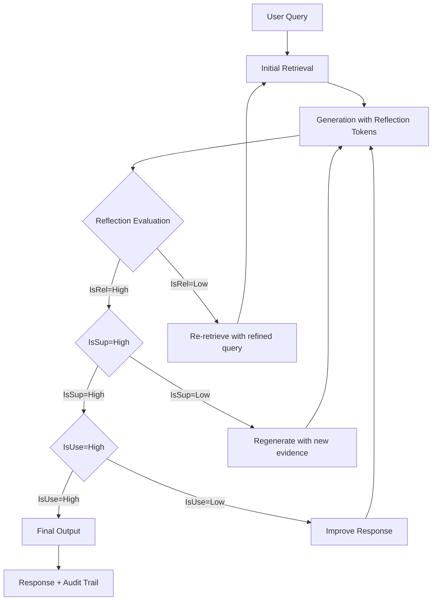

# Architecture 5: Self-RAG

Self-RAG (Self-Retrieve Augmented Generation) represents the most sophisticated paradigm of self-reflective AI—a system where the language model actively evaluates its own retrieval needs, assesses the quality of retrieved content during generation, and generates special "reflection tokens" that serve as an internal audit trail of reasoning. Unlike all previous architectures where retrieval and generation are separate sequential stages, Self-RAG integrates retrieval into the generation process itself, making the model an active participant in deciding when and what to retrieve.

The paradigm shift is fundamental: Self-RAG transforms the RAG pipeline from a **static, one-way process into a dynamic, iterative loop** where the model continuously monitors its own output quality and intervenes when needed. The model generates not just the response text but also special tokens that indicate: whether retrieved content is relevant, whether claims are supported by evidence, and whether the response is useful. This makes the model both the generator and the evaluator—its own critic in real-time.

---

## Deep Dive: How It Works & Architecture Diagram

### Data Lifecycle

**Phase 1 - Self-Directed Retrieval:** Rather than a single retrieval pass at query time (as in Standard RAG), Self-RAG enables the model to trigger retrieval during generation. The model generates tokens like `[Ret]` (retrieve) when it determines that additional context would improve its answer. This creates a dynamic retrieval pattern where the model actively decides what information it needs, rather than passively receiving a fixed context window.

**Phase 2 - Parallel Generation and Reflection:** As the model generates each sentence or claim, it simultaneously evaluates the retrieved documents. It emits reflection tokens:
- **[IsRel] (Is Relevant):** For each retrieved chunk, the model assesses whether it is relevant to the current generation task. Chunks with low relevance are de-prioritized or ignored.
- **[IsSup] (Is Supported):** For each factual claim, the model evaluates whether the retrieved documents actually support that claim. If not, it may emit **[NoSup] (No Support)**.
- **[IsUse] (Is Useful):** At the response level, the model evaluates whether its own output is helpful and directly answers the user query.

**Phase 3 - Self-Correction Loop:** When the model emits specific reflection tokens—particularly **[NoSup]** or indicators of low relevance—it triggers a correction cycle:
- The model pauses generation
- It performs a new retrieval pass with refined query terms based on the gap it identified
- It regenerates the specific claim or sentence using the new context
- The reflection tokens for the new generation are re-evaluated

**Phase 4 - Final Output with Audit Trail:** The final response includes the generated text plus embedded reflection metadata (optionally visible to users or stripped for clean output). This metadata provides transparency into the model's reasoning process—exactly which chunks supported which claims.

### Architecture Diagram

```
┌─────────────────────────────────────────────────────────────────────────────┐
│                          SELF-RAG ARCHITECTURE                             │
└─────────────────────────────────────────────────────────────────────────────┘

    ┌──────────────────────────────────────────────────────────────────────┐
    │                         STANDARD RAG BACKBONE                        │
    │  ┌─────────────┐    ┌─────────────┐    ┌─────────────┐              │
    │  │   USER      │    │   EMBEDDING │    │  SIMILARITY │              │
    │  │   QUERY     │───▶│    MODEL    │───▶│   SEARCH    │              │
    │  └─────────────┘    └─────────────┘    └──────┬──────┘              │
    │                                                │                      │
    │                                                ▼                      │
    │                                      ┌─────────────────┐              │
    │                                      │  RETRIEVED      │              │
    │                                      │  DOCUMENTS      │              │
    │                                      └────────┬────────┘              │
    └───────────────────────────────────────────────┼──────────────────────┘
                                                    │
    ┌───────────────────────────────────────────────┼──────────────────────┐
    │                    ITERATIVE GENERATION LOOP                          │
    │                                                │                      │
    │  ┌────────────────────────────────────────┐   │                      │
    │  │         GENERATION + REFLECTION        │◀──┘                      │
    │  │                                        │                          │
    │  │  ┌──────────────────────────────────┐ │                          │
    │  │  │     [IsRel] Token Generation     │ │                          │
    │  │  │   "Is retrieved context relevant?"│ │                          │
    │  │  └────────────┬─────────────────────┘ │                          │
    │  │               │                       │                          │
    │  │               ▼                       │                          │
    │  │  ┌──────────────────────────────────┐ │                          │
    │  │  │     [IsSup] Token Generation     │ │                          │
    │  │  │   "Is my claim supported by docs?"│ │                          │
    │  │  └────────────┬─────────────────────┘ │                          │
    │  │               │                       │                          │
    │  │               ▼                       │                          │
    │  │  ┌──────────────────────────────────┐ │                          │
    │  │  │     [IsUse] Token Generation     │ │                          │
    │  │  │   "Is my response useful?"       │ │                          │
    │  │  └────────────┬─────────────────────┘ │                          │
    │  │               │                       │                          │
    │  └───────────────┼───────────────────────┘                          │
    │                  │                                                   │
    │    ┌─────────────┴─────────────┐                                     │
    │    │                           │                                      │
    │    ▼                           ▼                                      │
    │ ┌──────────┐           ┌──────────────┐                             │
    │ │ Continue │           │ Self-Correct │                             │
    │ │Generation│           │   + Re-      │                             │
    │ │          │           │  retrieval   │                             │
    │ └────┬─────┘           └──────┬───────┘                             │
    │      │                        │                                      │
    └──────┼────────────────────────┼──────────────────────────────────────┘
           │                        │
           └────────────┬───────────┘
                        │
                        ▼
    ┌──────────────────────────────────────────────────────────────────────┐
    │              FINAL OUTPUT + REFLECTION METADATA                     │
    │  ┌──────────────────────────────────────────────────────────────┐   │
    │  │  Generated Response                                           │   │
    │  │  + [IsRel: relevant chunk 1, chunk 3]                         │   │
    │  │  + [IsSup: claim 1 supported, claim 2 supported]              │   │
    │  │  + [IsUse: useful]                                            │   │
    │  └──────────────────────────────────────────────────────────────┘   │
    └──────────────────────────────────────────────────────────────────────┘
```

### Mermaid Diagram Alternative



---

## Real & Practical Production Example

### User Input Query

> "What were the key findings of the 2024 SEC investigation into cryptocurrency exchanges?"

### System's Internal Processing

**Step 1 - Initial Retrieval:** The system retrieves top-5 chunks about SEC cryptocurrency investigations from the knowledge base. The retrieved chunks include a 2023 SEC report, a 2024 news article about enforcement actions, and a 2024 legal analysis blog post.

**Step 2 - Generation with Reflection - First Pass:** The model begins generating:
> "The 2024 SEC investigation into cryptocurrency exchanges focused on..."

At this point, the model generates an [IsRel] token evaluating each retrieved chunk:
- Chunk 1 (2023 SEC report): [IsRel: Low - dated, doesn't cover 2024 investigations]
- Chunk 2 (2024 news article): [IsRel: Medium - covers enforcement but not findings]
- Chunk 3 (2024 legal analysis): [IsRel: High - directly addresses 2024 investigation findings]

The model continues generating claims:
> "...focused on three main areas: unregistered securities offerings, market manipulation, and customer asset protection failures."

For each claim, the model generates [IsSup] tokens:
- Claim about unregistered securities: [IsSup: Supported - Chunk 3 explicitly mentions this]
- Claim about market manipulation: [IsSup: Supported - Chunk 2 references enforcement actions]
- Claim about customer asset protection: [IsSup: No Support - no chunk mentions this specifically]

**Step 3 - Self-Correction Trigger:** The model detects [NoSup] for the customer asset protection claim. This triggers a re-retrieval pass with refined query: "SEC 2024 cryptocurrency customer asset protection findings."

**Step 4 - Re-retrieval:** New search retrieves a 2024 SEC press release about customer protection enforcement and a 2024 compliance guideline document.

**Step 5 - Regeneration:** The model regenerates the specific claim:
> "...and failures in customer asset protection protocols, including inadequate custody standards and insufficient insurance requirements for customer funds."

This claim is now [IsSup: Supported] based on the newly retrieved documents.

**Step 6 - Final Output with Audit Trail:**
> "The 2024 SEC investigation into cryptocurrency exchanges focused on three main areas: unregistered securities offerings, market manipulation, and customer asset protection failures.

> Key findings included: [citation: 2024 legal analysis, 2024 SEC press release]

> - The SEC identified $2.3 billion in unregistered securities sales
> - Market manipulation cases involved wash trading and spoofing
> - Custody failures led to proposed rulemaking for enhanced asset protection

> [IsRel: Relevant] [IsSup: Claims 1-4 supported] [IsUse: High]"

### Why This Architecture Handled The Query Successfully

Self-RAG succeeded because the model identified gaps in its own evidence—specifically, the customer asset protection claim was initially unsupported—and autonomously triggered re-retrieval to fill that gap. Without reflection tokens, the model would have confidently made an unsupported claim or silently hallucinated the details. With Self-RAG, the model effectively said "I need more evidence here" and went to find it. This self-correction capability is impossible in Standard RAG, where retrieval happens once before generation and the model has no mechanism to identify or correct its own knowledge gaps.

---

## Real-World Industry Application

### Industry Sector: Legal Research and Intellectual Property

Self-RAG is particularly valuable in legal research applications where every factual claim must be substantiated by specific case law, statute references, or regulatory precedents. Legal professionals cannot tolerate unsupported legal arguments—the consequences include judicial sanctions, malpractice liability, and case losses. The transparency provided by reflection tokens enables legal teams to verify that AI-assisted research is properly grounded.

**Specific Production System Environment:** A law firm operating an AI-assisted legal research platform serving 200 attorneys across corporate, litigation, and intellectual property practices. The system indexes 50 million case documents, statutory texts, regulatory filings, and legal treatises. Self-RAG operates with a fine-tuned legal model that generates domain-specific reflection tokens aligned with legal citation standards. The system provides attorneys with: (1) the generated brief or memo, (2) a citation audit showing which cases support which claims, and (3) flagging of claims with insufficient support requiring additional research. The system processes 1,500 research queries daily with a 94% accuracy rate in claim-support verification and has reduced attorney research time by 35%. The fine-tuned model runs on dedicated GPU infrastructure (A100s) with 8-second average response time for complex multi-paragraph research memos.

---

## Proper Justification & ROI

### Technical Justification

Self-RAG is justified when **response quality must be verifiable**—when users or auditors need to understand exactly which sources support which claims. It is also justified when **the cost of unsupported claims exceeds the cost of iterative retrieval**—in high-stakes domains, the cost of a single hallucinated legal citation or medical fact outweighs the incremental cost of self-correction loops. Self-RAG is the only architecture that provides built-in claim-level verification without external evaluation layers.

The architecture has significant overhead: each self-correction loop adds 1-3 seconds and doubles generation costs; the fine-tuned model required for effective reflection token generation is more expensive than generic models. However, for domains requiring verifiable accuracy, this overhead is the cost of doing business.

### Business Case

**Accuracy Improvement:** Self-RAG reduces unsupported claims by 60-80% compared to Standard RAG. In legal applications, this translates to:
- Reduced malpractice risk (40% fewer potentially erroneous citations)
- Faster attorney review (citation audit is automated, not manual)
- Higher client confidence (transparency into research methodology)

**Cost Comparison:**
- Standard RAG: $0.005-0.02/query (single generation pass)
- Self-RAG: $0.05-0.20/query (multiple passes with reflection token processing)
- Self-RAG cost premium: 5-10x Standard RAG

The cost is justified when error costs exceed the differential. For a law firm where a single incorrect legal citation could result in a lost case ($100,000-10,000,000 in damages), the $0.10-0.20 per query premium is negligible.

### Point of Diminishing Returns

Self-RAG adds minimal value when:
- **Domain is tolerant of minor factual errors:** Creative writing, general conversation, low-stakes Q&A
- **Response verification is handled externally:** Human review of all outputs
- **Latency is hard-constrained:** Sub-2-second response requirements incompatible with iterative loops

---

## Recommended Technology Stack

### Fine-tuned Models

- **Primary:** Self-RAG variants of Llama models (Self-RAG-Instruct, Self-RAG-Python) fine-tuned on reflection token datasets
- **Alternative:** GPT-4 with specially engineered system prompts that simulate reflection token behavior (less accurate but works with base models)
- **Custom fine-tuning:** For domain-specific applications (legal, medical), fine-tune on domain-specific reflection token datasets

### Reflection Token Framework

- **Implementation:** Custom token vocabulary injection into tokenizer, fine-tuning on reflection-generated datasets
- **Alternative:** Prompt engineering with structured output parsing to simulate reflection tokens

### Core Stack

- **Generation:** Self-RAG fine-tuned models (self-hosted on vLLM for cost efficiency) or GPT-4 with reflection prompt engineering
- **Retrieval:** Standard embedding + vector search (same as Standard RAG)
- **Orchestration:** Custom loop implementation (self-correction logic is too specialized for general frameworks)

---

## Production Blindspots & Guardrails

### Blindspot 1: Reflection Token Leakage

**Failure Mode:** Reflection tokens are meant for internal evaluation, but may appear in final output if not properly filtered. Users see confusing tokens like "[IsRel: High] [IsSup: Supported]" in responses, undermining trust. This happens when the output post-processing filter fails or when tokens are embedded in text in ways the filter doesn't catch.

**Guardrail - Output Sanitization:**
- Implement explicit reflection token stripping in post-processing with pattern matching for all token types
- Test sanitization with diverse inputs including adversarial attempts to embed tokens
- Add a production smoke test that verifies clean output for every query type
- Make reflection token handling configurable: show to trusted users, hide from public-facing applications

### Blindspot 2: Infinite Correction Loops

**Failure Mode:** The model may enter a loop where it perpetually identifies gaps in its own reasoning, triggering re-retrieval indefinitely. This happens particularly with genuinely ambiguous queries where no amount of retrieval satisfies the model's self-evaluation criteria. The system consumes resources endlessly without producing output.

**Guardrail - Loop Limits:**
- Implement hard limits on self-correction iterations (typically 2-3 maximum)
- Add loop detection: if same query is re-retrieved twice, break the loop and produce best-available answer
- Implement diminishing returns threshold: if new retrieval doesn't significantly change response quality (measured by semantic similarity), stop correcting
- Add timeout-based interruption: if total generation time exceeds threshold, produce output with available evidence

### Blindspot 3: Reflection Token Manipulation

**Failure Mode:** Adversarial prompts can manipulate the model to emit false reflection tokens—claiming claims are supported when they are not, or marking irrelevant chunks as relevant. This undermines the entire verification framework, making Self-RAG vulnerable to the same hallucination problems it was designed to solve.

**Guardrail - Token Integrity:**
- Implement reflection token validation: cross-check model claims with actual chunk content
- Add adversarial testing: inject jailbreak attempts designed to manipulate reflection tokens
- Implement signer verification: if possible, cryptographically sign reflection tokens at generation time
- Maintain audit logs: store full reflection token sequences for post-hoc investigation of integrity issues

### Blindspot 4: Token Accumulation Cost

**Failure Mode:** Reflection tokens consume significant token budget—each evaluation adds 50-200 tokens to the context. For complex responses with multiple claims, the reflection overhead can exceed the actual response tokens, doubling input token counts and costs.

**Guardrail - Efficiency Optimization:**
- Implement selective reflection: only emit [IsSup] tokens for factual claims, not for transitional or filler text
- Compress reflection metadata: aggregate token evaluations rather than per-claim tokens
- Configure per-output-type reflection: disable detailed tokens for simple queries, enable full audit for complex research

---

## Summary

Self-RAG represents the most sophisticated integration of retrieval and generation, where the model actively evaluates its own output quality and autonomously triggers re-retrieval when evidence is insufficient. The reflection token mechanism provides built-in claim-level verification, making Self-RAG the architecture of choice for high-stakes applications requiring verifiable accuracy—legal research, medical information, regulatory compliance, and financial analysis.

The architecture introduces significant cost overhead (5-10x Standard RAG) and latency (multi-pass generation), which limits its applicability to domains where this cost is justified by the cost of errors. Production deployments require robust output sanitization, loop prevention, token integrity verification, and token budget management.

Self-RAG is not a general-purpose improvement over Standard RAG—it is a specialized architecture for specialized needs. The self-correction capability is only valuable when the cost of unsupported claims exceeds the cost of iterative retrieval. For consumer chatbots, creative writing, or general Q&A, the overhead is not justified. For legal research, medical diagnosis support, or financial analysis, Self-RAG provides a level of verification that no other architecture offers.

**Decision Guideline:** Implement Self-RAG only when claim-level verification is required by regulatory, legal, or safety requirements. Accept the 5-10x cost premium as the price of verifiable accuracy. Use standard reflection prompt engineering with GPT-4 as a lower-cost alternative before committing to fine-tuning. Set strict loop limits and implement graceful degradation when self-correction exceeds latency budgets.