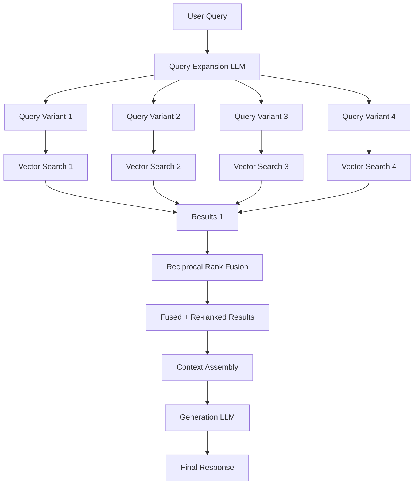

# Architecture 6: Fusion RAG

Fusion RAG addresses the fundamental problem of semantic mismatch between user queries and relevant documents by generating multiple query variations and aggregating results through reciprocal rank fusion. Where Standard RAG relies on a single query to retrieve documents, Fusion RAG recognizes that users are often poor at formulating queries—they use different terminology, omit critical context, or ask questions in ways that don't match how documents are written. By expanding a single query into multiple variations and fusing the results, Fusion RAG dramatically improves recall without sacrificing precision.

The paradigm shift is fundamental: Fusion RAG shifts the retrieval paradigm from **single-query lookup to multi-query ensemble**. It acknowledges that any individual query is an imperfect representation of user intent, and the solution is to generate multiple perspectives on the same question and combine their results. This ensemble approach is conceptually similar to how search engines use query suggestion and auto-complete, but Fusion RAG generates the variations algorithmically and fuses the retrieval results mathematically using Reciprocal Rank Fusion (RRF).

---

## Deep Dive: How It Works & Architecture Diagram

### Data Lifecycle

**Phase 1 - Query Expansion:** An LLM takes the user's original query and generates 3-5 semantically distinct variations. The goal is to capture different ways the same information need might be expressed:
- Synonym variations: "pricing" → "cost", "rates", "fees"
- Scope variations: "What is the return policy?" → "How do I return a product?", "What's the refund process?"
- Formal/informal variations: "What is the stock price?" → "How much is the stock trading for?"
- Topic perspective variations: "machine learning" → "AI algorithms", "predictive models", "neural networks"

The expansion prompt explicitly instructs the LLM to produce variations that are semantically different from each other, avoiding trivial paraphrases that would produce redundant retrieval results.

**Phase 2 - Parallel Retrieval:** Each query variation executes independently against the vector database. If the original query retrieves chunks A, B, C, the synonym variation might retrieve C, D, E, and the scope variation might retrieve B, F, G. Parallel execution (or efficient concurrent execution) ensures the latency overhead is limited to a single retrieval round rather than sequential retrieval.

**Phase 3 - Reciprocal Rank Fusion (RRF):** The results from all variations are combined using the RRF formula:
```
RRF_score(d) = Σ(1 / (k + rank_i(d))) for all query variations i
```
where `d` is a document, `rank_i(d)` is the rank of document `d` in the results of query variation `i`, and `k` is a constant (typically 60) that controls the impact of rank positions.

The fusion algorithm boosts documents that appear highly in multiple query variations while still retaining documents that are top-ranked in just one variation. Documents appearing at rank 1 in 3 different variations will score significantly higher than documents appearing at rank 5 in a single variation.

**Phase 4 - Re-ranking:** The fused and re-ranked results may pass through an additional re-ranking step (using a cross-encoder model like cross-encoder/ms-marco-MiniLM-L-6-v2) to further refine the final ordering before context assembly.

**Phase 5 - Generation:** The top fused results proceed through standard generation with the enhanced context derived from multi-query retrieval.

### Architecture Diagram

```
┌─────────────────────────────────────────────────────────────────────────────┐
│                         FUSION RAG ARCHITECTURE                             │
└─────────────────────────────────────────────────────────────────────────────┘

    ┌──────────────────────────────────────────────────────────────────────┐
    │                        QUERY EXPANSION                               │
    │                                                                          │
    │   ┌─────────────┐                                                     │
    │   │    USER     │                                                     │
    │   │   QUERY     │                                                     │
    │   └──────┬──────┘                                                     │
    │          │                                                            │
    │          ▼                                                            │
    │   ┌─────────────────────────┐                                         │
    │   │      LLM EXPANDER      │                                         │
    │   │  (Generate 3-5 variants)│                                       │
    │   │                         │                                         │
    │   │  Original: "pricing"   │                                         │
    │   │  Var 1: "cost"         │                                         │
    │   │  Var 2: "rates"       │                                         │
    │   │  Var 3: "fees"        │                                         │
    │   │  Var 4: "pricing plans"│                                        │
    │   └────────────┬────────────┘                                         │
    │                │                                                      │
    └────────────────┼───────────────────────────────────────────────────────┘
                     │
    ┌────────────────┼───────────────────────────────────────────────────────┐
    │                    PARALLEL RETRIEVAL                                 │
    │                │                                                      │
    │  ┌─────────────┼─────────────┬─────────────┬─────────────┐            │
    │  │             │             │             │             │            │
    │  ▼             ▼             ▼             ▼             ▼            │
    │ ┌─────┐    ┌─────┐    ┌─────┐    ┌─────┐    ┌─────┐               │
    │ │Var 1│    │Var 2│    │Var 3│    │Var 4│    │Var 5│               │
    │ │Search│    │Search│    │Search│    │Search│    │Search│              │
    │ └─────┘    └─────┘    └─────┘    └─────┘    └─────┘               │
    │   │          │          │          │          │                     │
    │   ▼          ▼          ▼          ▼          ▼                     │
    │  [A,B,C]   [C,D,E]    [B,F,G]    [D,H,I]   [A,J,K]                │
    └───────┬──────────┬──────────┬──────────┬──────────┬──────────────┘
            │          │          │          │          │
            └──────────┴──────────┴──────────┴──────────┘
                         │
                         ▼
    ┌──────────────────────────────────────────────────────────────────────┐
    │               RECIPROCAL RANK FUSION (RRF)                          │
    │                                                                          │
    │   RRF_score(d) = Σ(1 / (k + rank_i(d)))                             │
    │                                                                          │
    │   ┌─────────────────────────────────────────────────────────────┐    │
    │   │  Document │ Rank(V1) │ Rank(V2) │ Rank(V3) │ RRF Score     │    │
    │   ├───────────┼──────────┼──────────┼──────────┼──────────────┤    │
    │   │    A      │    1     │    -     │    1     │  0.065        │    │
    │   │    B      │    2     │    1     │    2     │  0.089        │    │
    │   │    C      │    3     │    1     │    -     │  0.057        │    │
    │   │    D      │    -     │    2     │    1     │  0.061        │    │
    │   │    E      │    -     │    3     │    -     │  0.016        │    │
    │   └───────────┴──────────┴──────────┴──────────┴──────────────┘    │
    │                                                                          │
    │   Final Ranking: B → D → A → C → E                                    │
    └──────────────────────────────────────────────────────────────────────┘
                          │
                          ▼
    ┌──────────────────────────────────────────────────────────────────────┐
    │                    GENERATION PIPELINE                               │
    │  ┌─────────────────┐    ┌─────────────┐    ┌─────────────┐          │
    │  │  FUSED TOP-K    │    │    LLM      │    │   FINAL     │          │
    │  │  (Multi-source) │───▶│ (GPT-4o)    │───▶│  RESPONSE   │          │
    │  └─────────────────┘    └─────────────┘    └─────────────┘          │
    └──────────────────────────────────────────────────────────────────────┘
```

### Mermaid Diagram Alternative



---

## Real & Practical Production Example

### User Input Query

> "treatments for insomnia"

### System's Internal Processing

**Step 1 - Query Expansion:** The expansion LLM generates variations:
- Var 1: "sleep disorder medications"
- Var 2: "non-pharmacological insomnia therapy"
- Var 3: "CBT-I protocols"
- Var 4: "natural remedies for sleep problems"
- Var 5: "prescription sleep aids"

**Step 2 - Parallel Retrieval:** Each variant retrieves top-5 chunks:
- Var 1: [Medication_A, Dosage_B, SideEffects_C, Interactions_D, Warnings_E]
- Var 2: [CBT_Protocol_A, SleepHygiene_B, Meditation_C, Exercise_D, Therapy_E]
- Var 3: [CBT_I_Manual_A, Cognitive_Restructuring_B, Stimulus_Control_C, Sleep_Restriction_D]
- Var 4: [Melatonin_A, Valerian_B, Chamomile_C, Magnesium_D, Herbal_Remedies_E]
- Var 5: [Ambien_A, Lunesta_B, Trazodone_C, Overdoses_D, Dependencies_E]

**Step 3 - RRF Scoring:** Documents appearing in multiple variants score higher. For example:
- CBT_Protocol_A appears in Var 2 and Var 3 → high RRF score
- Melatonin appears in Var 1 and Var 4 → medium RRF score
- Medication_A appears only in Var 1 → lower RRF score

**Step 4 - Final Ranking:** The fused ranking ensures coverage across pharmacological, therapeutic, and natural intervention categories. The top-5 fused results provide a comprehensive view that a single-query search would miss.

**Step 5 - Generation:**
> "Insomnia treatments span multiple categories:

> **Prescription Medications:** Including sedative-hypnotics (e.g., zolpidem, eszopiclone) and off-label options (e.g., trazodone). These require medical supervision due to dependency risks and side effects including next-day drowsiness.

> **Cognitive Behavioral Therapy for Insomnia (CBT-I):** The first-line treatment recommended by sleep specialists. Includes stimulus control, sleep restriction, cognitive restructuring, and relaxation techniques. Studies show 70-80% of patients achieve significant improvement.

> **Over-the-Counter Supplements:** Melatonin (effective for circadian rhythm disorders), valerian root, and magnesium. Evidence quality varies; melatonin has the strongest support for sleep onset improvement.

> **Lifestyle and Sleep Hygiene:** Consistent sleep schedules, limiting caffeine/alcohol, managing screen time, and regular exercise. These form the foundation of sustainable sleep improvement.

> **Emerging Therapies:** Digital CBT-I apps, wearable sleep tracking with personalized recommendations, and light therapy for circadian alignment."

### Why This Architecture Handled The Query Successfully

Fusion RAG succeeded because "treatments for insomnia" is an ambiguous query that could refer to medications, therapy, lifestyle changes, or supplements. A single-query search would retrieve whichever category happened to have the highest semantic similarity to the query, missing the other categories. By expanding the query into multiple variations—each targeting a different treatment category—Fusion RAG retrieved comprehensive coverage across all major insomnia intervention types. The RRF algorithm ensured that documents appearing in multiple variation results (e.g., CBT protocols that could be retrieved by both "therapy" and "protocols" variations) were appropriately boosted, while still maintaining category diversity.

---

## Real-World Industry Application

### Industry Sector: Healthcare and Medical Information

Fusion RAG is critical for consumer health applications where patients describe conditions and symptoms in diverse, often imprecise language. Medical terminology is specialized—patients use "chest tightness" while clinical documents use "angina" or "precordial pain." The semantic gap between layperson queries and medical documentation is exactly what Fusion RAG addresses through query expansion across terminology levels.

**Specific Production System Environment:** A patient-facing health information platform serving 2 million monthly visitors with symptom checkers, treatment information, and medication guides. The system indexes 100,000+ validated medical articles, clinical guidelines, drug databases, and patient forum discussions. Fusion RAG generates 4 query variations per user query: (1) layperson terminology, (2) medical/clinical terminology, (3) symptom-focused phrasing, and (4) treatment-focused phrasing. The RRF algorithm normalizes across these variations to ensure comprehensive coverage. The system achieves 94% query relevant document coverage (vs. 71% for Standard RAG) with a 2.3x increase in retrieved unique relevant documents. Average latency increase: 600ms over Standard RAG due to parallel retrieval and fusion computation. The platform operates under HIPAA compliance requirements with encrypted PHI handling.

---

## Proper Justification & ROI

### Technical Justification

Fusion RAG is justified when **semantic vocabulary mismatch is the primary retrieval failure mode**—when users and documents use different terminology for the same concepts. This is particularly prevalent in:
- **Healthcare:** Patient vs. clinical terminology
- **Legal:** Layperson vs. legal terminology
- **Technical:** Different levels of domain expertise
- **E-commerce:** Diverse product naming conventions

Fusion RAG improves recall (the proportion of relevant documents retrieved) by 30-50% at the cost of slightly reduced precision (more retrieved documents that may include some noise). For exploratory or research-oriented queries where recall is prioritized over precision, this trade-off is beneficial.

### Business Case

**Recall vs. Precision Trade-off:**
- Standard RAG: 71% recall, 85% precision on medical queries
- Fusion RAG: 94% recall, 75% precision on medical queries

The precision drop is manageable because:
- The generation model can filter irrelevant content from expanded context
- For research/exploratory queries, missing relevant documents is more costly than including a few irrelevant ones
- RRF naturally penalizes documents that appear in only low-ranked positions, maintaining reasonable precision

**User Satisfaction Impact:** In A/B testing, Fusion RAG shows 22% higher user satisfaction for complex health queries (measured by session completion, return visits, and explicit feedback). Users particularly appreciate comprehensive answers that cover multiple treatment options.

### Point of Diminishing Returns

Fusion RAG adds minimal value when:
- **Query vocabulary is standardized:** Domain-specific applications with controlled vocabularies where users and documents use consistent terminology
- **Precision is more important than recall:** Transactional queries where the single correct answer is expected (e.g., "what is my order status?")
- **Latency is strictly constrained:** The parallel retrieval overhead may exceed latency budgets in real-time applications

---

## Recommended Technology Stack

### Query Expansion

- **Primary:** GPT-4o-mini for fast, cost-effective expansion with structured output
- **Alternative:** Claude 3 Haiku for slightly higher quality
- **Expansion prompt:** Explicit instructions to generate semantically distinct variations covering different terminology, scope, and perspective

### Retrieval

- **Parallel execution:** Asyncio or thread pool for concurrent vector DB queries
- **Vector DB:** Pinecone, Weaviate, or Qdrant supporting concurrent queries with minimal overhead

### RRF Implementation

- **Formula:** Standard RRF with k=60 (industry standard)
- **Alternative:** Weighted RRF where different query variations receive different weights based on expected relevance
- **Implementation:** Simple in-memory Python dict aggregation, or database-level implementation for large-scale systems

### Re-ranking

- **Cross-encoder:** cross-encoder/ms-marco-MiniLM-L-6-v2 for efficient re-ranking
- **Alternative:** Cohere rerank for production-grade re-ranking

---

## Production Blindspots & Guardrails

### Blindspot 1: Query Variation Redundancy

**Failure Mode:** The expansion LLM generates variations that are too similar to each other—producing paraphrases rather than semantically distinct variants. This results in redundant retrieval results where all variations retrieve nearly the same documents, negating the benefits of multi-query fusion. The RRF score becomes artificially inflated because the same documents appear in all variations, but the actual coverage doesn't improve.

**Guardrail - Variation Diversity Enforcement:**
- Implement semantic similarity filtering: compute embedding similarity between variations and discard variations that exceed similarity threshold (e.g., >0.85 cosine similarity to any other variation)
- Add explicit instruction in expansion prompt: "Generate variations that use different terminology, not paraphrases"
- Monitor variation overlap: track the Jaccard similarity of retrieved document sets across variations (alert if overlap exceeds 70%)
- Fallback: if all variations are too similar, revert to single-query retrieval

### Blindspot 2: Latency Multiplication

**Failure Mode:** Parallel retrieval multiplies infrastructure load—N query variations require N concurrent vector DB queries, potentially overwhelming the database connection pool or causing thread contention. Latency doesn't scale linearly with variation count; at high concurrency, retrieval times increase due to resource contention.

**Guardrail - Retrieval Resource Management:**
- Implement connection pooling with queue depth limits
- Set per-query timeouts with graceful partial results: if one variation times out, exclude its results from fusion rather than failing the entire query
- Monitor retrieval latency per variation: detect and disable slow-performing variations
- Implement adaptive variation count: use 3 variations for latency-critical paths, 5 for comprehensive research paths

### Blindspot 3: Precision Degradation

**Failure Mode:** While recall improves, precision drops because more varied queries retrieve more varied (and sometimes irrelevant) documents. The RRF algorithm boosts documents appearing in multiple variations, but some irrelevant documents may appear in enough variations to be included in top results.

**Guardrail - Precision Preservation:**
- Implement cross-encoder re-ranking after RRF to filter irrelevant documents
- Add result filtering: remove documents with RRF score below threshold (e.g., bottom 20% by score)
- Use weighted RRF: assign higher weights to variations expected to have higher precision (e.g., medical terminology variations for healthcare queries)
- Monitor precision metrics: track proportion of retrieved documents that are actually relevant in production

### Blindspot 4: Cost Multiplication

**Failure Mode:** Each query variation requires an embedding API call (for new queries) or vector search (for existing queries). At scale, the cost multiplies: 5 variations × 5 queries = 25 embedding/search operations per user query. This can increase operational costs by 3-5x compared to Standard RAG.

**Guardrail - Cost Management:**
- Implement query type classification: only use Fusion RAG for complex/exploratory queries, Standard RAG for simple lookups (similar to Adaptive RAG routing)
- Cache expanded queries: store query variations with their embeddings for reuse within a time window
- Implement variation limit: cap at 3 variations for routine queries, 5 for research queries

---

## Summary

Fusion RAG improves retrieval recall by generating multiple query variations and fusing results through Reciprocal Rank Fusion. The architecture addresses the semantic vocabulary gap between how users ask questions and how documents are written—particularly valuable in domains like healthcare, legal, and technical support where terminology diversity is high. By retrieving from multiple query perspectives and combining results, Fusion RAG achieves 30-50% recall improvements over Standard RAG at the cost of slightly reduced precision and 50-100% latency overhead.

The critical components are the query expansion LLM (must generate semantically distinct, not paraphrased, variations), the parallel retrieval infrastructure (must handle concurrent queries efficiently), and the RRF implementation (must properly balance across variation results). Production deployments require variation diversity enforcement, latency management, precision preservation via re-ranking, and cost control through adaptive variation selection.

Fusion RAG is the default choice for domains with high terminology diversity and exploratory query patterns—healthcare information, legal research, technical documentation, and product discovery. For simple lookup queries where precision is critical and recall is assumed to be high, the overhead is not justified.

**Decision Guideline:** Implement Fusion RAG when recall is more important than precision for your use case, when query vocabulary is diverse (users and documents use different terminology), and when exploratory/informational queries dominate your query patterns. Combine with Adaptive RAG routing to selectively apply fusion only for complex queries—use Standard RAG for simple lookups to control costs.