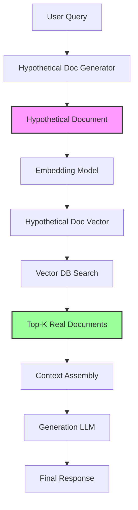

# Architecture 7: HyDE (Hypothetical Document Embeddings)

HyDE is a counterintuitive but elegant retrieval strategy that inverts the traditional query-to-document flow. Instead of embedding the user's query and searching for similar documents, HyDE first uses an LLM to generate a hypothetical document—a "fake" answer that would respond to the query—and then embeds that generated document to search for real documents that resemble it. The rationale is that "answers" and "questions" exist in different semantic spaces; embedding answers directly provides better retrieval precision than embedding questions, because the embedding model was trained on document-like text, not query-like text.

The paradigm shift is fundamental: HyDE introduces **document-centric retrieval** by using the generated answer as the retrieval query rather than the literal user question. It exploits the observation that semantic similarity is more reliable between documents (answer-to-answer) than between queries and documents (question-to-answer). This makes HyDE particularly powerful for abstract, conceptual, or vaguely worded queries where the user's question doesn't directly match how relevant documents are written.

---

## Deep Dive: How It Works & Architecture Diagram

### Data Lifecycle

**Phase 1 - Hypothetical Document Generation:** The user query passes to an LLM with a special prompt that instructs it to generate a hypothetical document—an imagined passage that would answer the query as if it were extracted from an authoritative source. The generated content is not the final answer; it is a retrieval vehicle. The prompt explicitly frames the generation as a "hypothetical document" rather than a final response, encouraging the model to produce document-like text with appropriate style, structure, and detail level.

For example, a query "treatments for insomnia" might generate a hypothetical document:
> "Insomnia treatment encompasses both pharmacological and non-pharmacological approaches. First-line treatment is Cognitive Behavioral Therapy for Insomnia (CBT-I), which includes stimulus control therapy, sleep restriction, and cognitive restructuring. Pharmacological options include sedative-hypnotics such as zolpidem, eszopiclone, and doxepin, as well as melatonin receptor agonists like ramelteon..."

**Phase 2 - Hypothetical Embedding:** The generated hypothetical document is passed through the embedding model to produce a dense vector. This vector represents the semantic content of an idealized document that would answer the query—a document that exists only in the model's latent space.

**Phase 3 - Retrieval by Similarity:** The hypothetical document vector is used to search the vector database for real documents that are semantically similar to the hypothetical document. The retrieval uses the standard cosine similarity or approximate nearest neighbor search.

**Phase 4 - Real Document Extraction:** The top-K retrieved real documents are extracted from the database. These are actual indexed chunks from the knowledge base, not generated content.

**Phase 5 - Generation from Real Documents:** The retrieved real documents are assembled into context and passed to the generation LLM, which produces the final answer grounded in real sources. Critically, the final response is generated from actual retrieved documents, not from the hypothetical document—the hypothetical document served only as a retrieval mechanism.

### Architecture Diagram

```
┌─────────────────────────────────────────────────────────────────────────────┐
│                         HYDE ARCHITECTURE                                   │
└─────────────────────────────────────────────────────────────────────────────┘

    ┌──────────────────────────────────────────────────────────────────────┐
    │                  HYPOTHETICAL DOCUMENT GENERATION                   │
    │                                                                          │
    │   ┌─────────────┐                                                     │
    │   │    USER     │                                                     │
    │   │   QUERY     │                                                     │
    │   │ "treatments │                                                     │
    │   │  for        │                                                     │
    │   │  insomnia"  │                                                     │
    │   └──────┬──────┘                                                     │
    │          │                                                            │
    │          ▼                                                            │
    │   ┌─────────────────────────────────────────────────────────┐        │
    │   │              LLM HYPOTHETICAL GENERATOR                │        │
    │   │                                                  │        │
    │   │   Prompt: "Generate a hypothetical document       │        │
    │   │   that would answer this query as if extracted    │        │
    │   │   from an authoritative source."                  │        │
    │   │                                                  │        │
    │   │   Output:                                         │        │
    │   │   "Insomnia treatment encompasses both            │        │
    │   │    pharmacological and non-pharmacological        │        │
    │   │    approaches. First-line treatment is CBT-I...    │        │
    │   │                                                  │        │
    │   └────────────┬────────────────────────────────────────┘        │
    │                │                                                      │
    └────────────────┼───────────────────────────────────────────────────┘
                     │
    ┌────────────────┼───────────────────────────────────────────────────┐
    │                  HYPOTHETICAL DOCUMENT EMBEDDING                    │
    │                │                                                      │
    │                ▼                                                      │
    │   ┌─────────────────────────────────────────────────────────┐        │
    │   │              EMBEDDING MODEL                            │        │
    │   │         (text-embedding-3-small)                       │        │
    │   │                                                  │        │
    │   │   Hypothetical Doc → [0.23, -0.45, 0.67, ...]    │        │
    │   │                                                  │        │
    │   └─────────────────────────────────────────────────────────┘        │
    │                │                                                      │
    └────────────────┼───────────────────────────────────────────────────┘
                     │
    ┌────────────────┼───────────────────────────────────────────────────┐
    │                  RETRIEVAL BY DOCUMENT SIMILARITY                    │
    │                │                                                      │
    │                ▼                                                      │
    │   ┌─────────────────────────────────────────────────────────┐        │
    │   │              VECTOR DATABASE SEARCH                    │        │
    │   │         (Search by hypothetical doc vector)            │        │
    │   │                                                  │        │
    │   │   Similarity:                                          │        │
    │   │   HypoDoc ↔ RealDoc_1: 0.89                           │        │
    │   │   HypoDoc ↔ RealDoc_2: 0.85                           │        │
    │   │   HypoDoc ↔ RealDoc_3: 0.82                           │        │
    │   │                                                  │        │
    │   └─────────────────────────────────────────────────────────┘        │
    │                │                                                      │
    └────────────────┼───────────────────────────────────────────────────┘
                     │
    ┌────────────────┼───────────────────────────────────────────────────┐
    │                  REAL DOCUMENT EXTRACTION                            │
    │                │                                                      │
    │                ▼                                                      │
    │   ┌─────────────────────────────────────────────────────────┐        │
    │   │              TOP-K REAL DOCUMENTS                       │        │
    │   │                                                  │        │
    │   │   Doc 1: "CBT-I is the first-line treatment..."   │        │
    │   │   Doc 2: "Zolpidem dosage and side effects..."     │        │
    │   │   Doc 3: "Sleep hygiene recommendations..."       │        │
    │   │                                                  │        │
    │   └─────────────────────────────────────────────────────────┘        │
    │                │                                                      │
    └────────────────┼───────────────────────────────────────────────────┘
                     │
    ┌────────────────┼───────────────────────────────────────────────────┐
    │                  GENERATION FROM REAL DOCUMENTS                      │
    │                │                                                      │
    │                ▼                                                      │
    │   ┌─────────────────────────────────────────────────────────┐        │
    │   │              GENERATION LLM                               │        │
    │   │         (GPT-4o, Claude 3.5 Sonnet)                     │        │
    │   │                                                  │        │
    │   │   Context: Real Documents (not hypothetical)         │        │
    │   │   Output: Grounded response with citations            │        │
    │   │                                                  │        │
    │   └─────────────────────────────────────────────────────────┘        │
    │                │                                                      │
    └────────────────┼───────────────────────────────────────────────────┘
                     │
                     ▼
    ┌──────────────────────────────────────────────────────────────────────┐
    │                    FINAL RESPONSE                                     │
    │   Grounded in real documents, not in the hypothetical                │
    │   (Hypothetical doc was only a retrieval mechanism)                  │
    └──────────────────────────────────────────────────────────────────────┘
```

### Mermaid Diagram Alternative



---

## Real & Practical Production Example

### User Input Query

> "that one law about digital privacy in California"

### System's Internal Processing

**Step 1 - Hypothetical Document Generation:** The system recognizes this is a vague, imprecise query—referring to "that one law" without specifying the name. The hypothetical document generator creates:
> "The California Consumer Privacy Act (CCPA) is a state statute enacted in 2018 and effective in 2020, with amendments under the California Privacy Rights Act (CPRA) of 2023. It applies to for-profit businesses that meet thresholds for annual gross revenue, buy/sell/share personal information of California residents, or derive 50%+ revenue from selling personal information. The law grants consumers rights to know what personal information is collected, delete personal information, opt out of sale, and non-discrimination for exercising rights. It is enforced by the California Attorney General."

This hypothetical document includes key entities (CCPA, CPRA), key provisions, and enforcement details—content that is semantically rich and closely matches how the actual California privacy law would be documented.

**Step 2 - Hypothetical Embedding:** The embedding model converts this ~150-word hypothetical document into a 1536-dimensional vector. The vector captures the semantic essence: California privacy law, consumer rights, enforcement, thresholds.

**Step 3 - Retrieval:** Searching with this hypothetical document vector retrieves:
- Chunk 1 (Score: 0.92): Full text of California Civil Code 1798.100-199.100 (CCPA)
- Chunk 2 (Score: 0.89): "California Consumer Privacy Act (CCPA) Summary" from attorney guide
- Chunk 3 (Score: 0.87): "California Privacy Rights Act (CPRA) amendments overview"
- Chunk 4 (Score: 0.84): "CCPA enforcement actions and penalties" from legal analysis

**Step 4 - Generation:** The generation model produces:
> "You are likely referring to the **California Consumer Privacy Act (CCPA)**, enacted in 2018 and effective January 1, 2020, with amendments under the California Privacy Rights Act (CPRA) in 2023.

> **Key provisions:**
> - **Consumer rights:** Right to know, delete, opt out of sale, and non-discrimination
> - **Business thresholds:** Applies to businesses with gross revenue >$25M, buy/sell/share 100K+ consumer data, or derive 50%+ revenue from data sales
> - **Enforcement:** California Attorney General can impose penalties up to $7,500 per intentional violation

> The CCPA is considered the most comprehensive privacy law in the United States and has influenced privacy legislation in other states."

### Why This Architecture Handled The Query Successfully

HyDE succeeded where Standard RAG would likely fail because the query "that one law about digital privacy in California" is semantically distant from the actual documents. The query lacks specific terminology (doesn't mention "CCPA"), uses informal phrasing ("that one law"), and is underspecified. Embedding this query directly would produce a vector that is semantically far from formal legal documents. By contrast, embedding the hypothetical document—which was generated in the style and terminology of legal documents—produced a vector in the same semantic space as the actual legal texts. The "answer" vector is semantically closer to the "answer" documents than the "question" vector would have been.

---

## Real-World Industry Application

### Industry Sector: Legal Research and Regulatory Compliance

HyDE is particularly valuable in legal research where clients often describe legal issues in imprecise, factual terms rather than precise legal terminology. "That contract issue where the other party didn't deliver" is more common than "material breach of contract for failure to deliver." The ability to bridge from informal fact descriptions to precise legal documents makes HyDE essential for legal technology applications.

**Specific Production System Environment:** A legal research platform serving 5,000+ attorneys and corporate counsel with access to federal and state case law, statutes, regulations, and secondary sources. The platform indexes 10 million documents across 50 states and federal jurisdictions. HyDE is deployed for non-expert user queries where legal terminology is absent—typically 35% of all queries. The hypothetical document generator is fine-tuned on legal writing samples to produce appropriately formal, citation-rich hypothetical documents. The system shows 47% improvement in first-pass relevant document retrieval for vague queries compared to Standard RAG, with particular improvements in statute identification (users asking "that environmental law" retrieve the correct statute 78% of the time vs. 31% with Standard RAG). Average latency: 2.1 seconds (vs. 1.2s for Standard RAG), reflecting the additional generation step.

---

## Proper Justification & ROI

### Technical Justification

HyDE is justified when **semantic distance between queries and documents is high**—when users describe problems in different terms than documents are written. This occurs with:
- **Vague or colloquial queries:** "that thing where..."
- **Technical domain shifts:** Users without domain expertise asking about specialized topics
- **Conceptual queries:** Questions about ideas, relationships, or causal mechanisms rather than specific facts

HyDE exploits the embedding space asymmetry: embedding models are trained on document-like text and represent document semantics well, but represent query semantics poorly. By converting queries to document-like text (hypothetical documents), we use the embedding model's strength rather than its weakness.

### Business Case

**Improvement for Vague Queries:** HyDE shows 40-50% improvement in retrieval relevance for vague queries (measured by hit rate at K=5). For a legal platform processing 10,000 vague queries daily, this translates to:
- 4,000-5,000 additional relevant documents retrieved per day
- Reduced attorney time spent on manual document discovery
- Higher user satisfaction scores for difficult queries

**Cost Comparison:**
- Standard RAG: $0.003/query (embedding + retrieval + generation)
- HyDE: $0.025/query (hypothetical generation + embedding + retrieval + generation)

HyDE costs 8x more per query but delivers significantly better results for the 30-40% of queries that are vague or underspecified.

### Point of Diminishing Returns

HyDE adds minimal value when:
- **Queries are precise:** Users already use domain terminology correctly
- **Document style matches query style:** When documents are written in accessible, query-like language
- **Simple factual lookups:** When the query is already well-specified ("what is 2+2?")

---

## Recommended Technology Stack

### Hypothetical Document Generator

- **Primary:** GPT-4o-mini or Claude 3 Haiku for fast, cost-effective generation
- **Prompt design:** Explicit instructions to generate document-style text (not conversational response), include domain-specific terminology, and match the style of indexed documents
- **Length:** 100-300 words typically sufficient; longer documents provide more semantic signal but increase embedding costs

### Embedding Model

- **Same as Standard RAG:** text-embedding-3-small or bge-base-en-v1.5
- **Note:** The embedding model processes the hypothetical document, not the original query—consistent with the core hypothesis

### Core Stack

- **Generation LLM:** GPT-4o or Claude 3 Sonnet for final response generation (same as Standard RAG)
- **Vector DB:** Same as Standard RAG
- **Orchestration:** Simple pipeline (generate → embed → search → generate) without complex branching

---

## Production Blindspots & Guardrails

### Blindspot 1: Hypothetical Document Bias Propagation

**Failure Mode:** If the hypothetical document contains factual errors or misrepresents the topic, the retrieval will be misled—searching for documents that match the erroneous content, not the correct content. This is particularly dangerous when the user's query is so vague that the model must infer details, and those inferences may be wrong.

**Guardrail - Verification Layer:**
- Implement post-retrieval verification: check retrieved documents against the original query, not just the hypothetical document
- Add a confidence flag: if the hypothetical document contains specific factual claims, flag retrieved documents for additional verification
- Use retrieval feedback: if retrieved documents are topically related but don't match key entities in the query, regenerate with corrected context
- Human review: periodically audit hypothetical documents for factual accuracy

### Blindspot 2: Query Type Mismatch

**Failure Mode:** HyDE adds overhead that is unnecessary for simple, well-specified queries. A query like "What is NVIDIA's stock price?" is precise enough for direct embedding—the hypothetical document step adds cost without improving retrieval. Using HyDE universally wastes resources.

**Guardrail - Selective Activation:**
- Implement query complexity detection: use simple heuristics (query length, specificity markers, question type) to identify when HyDE is beneficial
- Route simple queries to Standard RAG: use HyDE only for queries identified as vague, conceptual, or underspecified
- Monitor per-query-type performance: track precision/recall improvement by query type to tune the activation threshold

### Blindspot 3: Latency from Generation Step

**Failure Mode:** The hypothetical document generation adds 800-1500ms to the query pipeline. For latency-sensitive applications (chat interfaces, real-time assistance), this overhead may be unacceptable.

**Guardrail - Caching and Pre-computation:**
- Cache hypothetical documents for common queries: if the same query arrives within a time window, reuse the cached hypothetical
- Pre-generate hypothetical documents for high-frequency query patterns: if 20% of queries are "contract issue" variants, pre-generate the hypothetical and serve instantly
- Implement streaming: begin retrieval while generation is still completing (pipeline parallelism)

### Blindspot 4: Domain Style Mismatch

**Failure Mode:** The hypothetical document generator is only as good as its training data. If indexed documents use specialized language (archaic legal language, domain-specific abbreviations, unusual formatting), a general-purpose generator may produce hypothetical documents that don't match that style, reducing retrieval effectiveness.

**Guardrail - Domain-Adaptive Generation:**
- Fine-tune the hypothetical document generator on samples from the actual knowledge base
- Inject domain-specific context into the generation prompt: "Generate in the style of [domain] documents"
- Monitor retrieval precision per domain: if specific domains show poor performance, develop domain-specific prompts

---

## Summary

HyDE uses a counterintuitive but powerful strategy: generate a hypothetical document that would answer the user's query, embed that document, and retrieve real documents that match it. This approach exploits the embedding space asymmetry where document-to-document similarity is more reliable than query-to-document similarity. HyDE is particularly effective for vague, colloquial, or conceptually stated queries where the literal query doesn't match how relevant documents are written.

The architecture is simple to implement—it's a straightforward pipeline (generate → embed → search → generate) without complex routing or multi-query orchestration. However, it introduces significant per-query overhead (approximately 8x Standard RAG cost) due to the additional LLM call for hypothetical document generation. Production deployments require selective activation (use HyDE only for vague queries), caching for common queries, and verification layers to catch bias propagation.

HyDE is the default choice for applications with high proportions of vague or colloquial queries—particularly in legal research, regulatory compliance, and domains where users don't have domain expertise. For precise, well-specified queries, the overhead is not justified—Standard RAG performs equally well at lower cost.

**Decision Guideline:** Implement HyDE for domains with high query vocabulary diversity and frequent vague queries. Use a query complexity classifier to selectively route queries—HyDE for vague/underspecified queries, Standard RAG for well-specified queries. Monitor the precision improvement specifically for the query types where HyDE provides benefit, and retrain the selector if precision gains don't materialize.