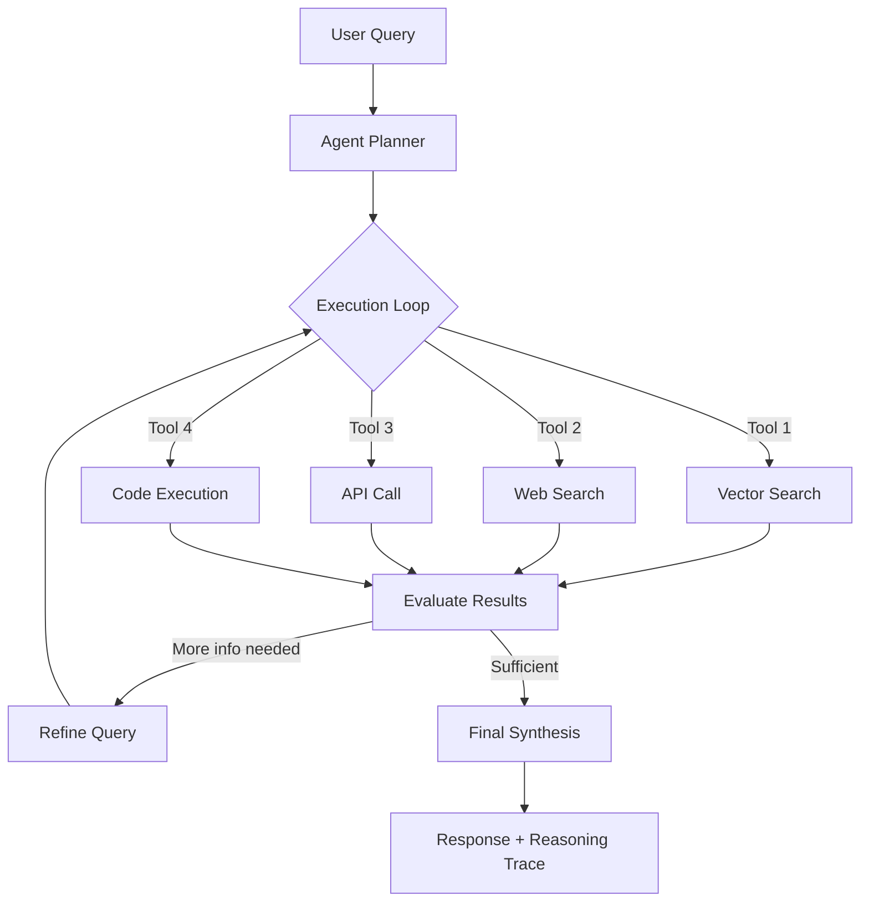

# Architecture 8: Agentic RAG

Agentic RAG introduces autonomous agentic reasoning into the retrieval pipeline, transforming RAG from a passive retrieval system into an active research assistant that plans, reasons, and iteratively refines its approach to complex queries. While all previous architectures execute fixed pipelines—retrieval then generation, or retrieval with evaluation then generation—Agentic RAG gives the system the ability to decide *how* to retrieve, *when* to retrieve, *what* to retrieve, and *whether* the retrieved information is sufficient. The agent can call multiple tools, execute multi-step plans, evaluate intermediate results, and dynamically adjust its strategy based on what it discovers.

The paradigm shift is fundamental: Agentic RAG introduces **reasoning-driven retrieval** rather than pipeline-driven retrieval. The system doesn't just execute a pre-determined sequence of retrieval and generation steps; it actively reasons about the query, formulates a plan, executes sub-tasks, evaluates results, and iterates until it has sufficient evidence to answer the question. This makes it the first architecture that treats information retrieval as a research task rather than a lookup task.

---

## Deep Dive: How It Works & Architecture Diagram

### Data Lifecycle

**Phase 1 - Query Analysis and Planning:** The incoming query enters the agent, which first performs analysis to understand what type of question it is:
- **Factual:** Requires specific facts from knowledge base ("When was company X founded?")
- **Comparative:** Requires comparing multiple entities or options ("Compare pricing of A vs B")
- **Causal:** Requires understanding cause-effect relationships ("How does X affect Y?")
- **Exploratory:** Requires synthesizing information across multiple topics
- **Multi-step:** Requires chaining through multiple logical steps

Based on the analysis, the agent formulates a retrieval plan—a sequence of sub-tasks, tool calls, and decision points. This plan is explicit and inspectable.

**Phase 2 - Tool Selection and Execution:** The agent selects appropriate tools for the plan:
- **Vector search:** For semantic retrieval from the knowledge base
- **Web search:** For external/current information
- **API calls:** For structured data (stock prices, weather, database queries)
- **Code execution:** For calculations, data processing, or analysis
- **LLM with context:** For subtasks like summarizing retrieved documents or generating follow-up queries

The agent executes these tools one at a time or in parallel where dependencies allow.

**Phase 3 - Intermediate Evaluation:** After each tool execution, the agent evaluates the results. It checks:
- Did the retrieval return relevant documents?
- Is the information sufficient to answer the query?
- Are there gaps or uncertainties that require additional retrieval?
- Does the information conflict or require reconciliation?

**Phase 4 - Iteration and Refinement:** Based on evaluation, the agent may:
- Formulate new retrieval queries based on gaps identified
- Re-rank or filter retrieved documents based on relevance
- Combine information from multiple sources
- Request additional clarification from the user if intent is ambiguous

**Phase 5 - Final Synthesis:** Once the agent determines it has sufficient evidence, it synthesizes a comprehensive response using the generation LLM with all gathered context.

### Architecture Diagram

```
┌─────────────────────────────────────────────────────────────────────────────┐
│                         AGENTIC RAG ARCHITECTURE                           │
└─────────────────────────────────────────────────────────────────────────────┘

    ┌──────────────────────────────────────────────────────────────────────┐
    │                         AGENT ORCHESTRATOR                          │
    │                                                                          │
    │   ┌─────────────┐                                                     │
    │   │    USER     │                                                     │
    │   │   QUERY     │                                                     │
    │   └──────┬──────┘                                                     │
    │          │                                                            │
    │          ▼                                                            │
    │   ┌─────────────────────────────────────────────────────────────┐      │
    │   │              QUERY ANALYSIS + PLANNING                      │      │
    │   │                                                       │         │
    │   │   • Classify query type (factual, comparative, causal)  │         │
    │   │   • Identify required information components           │         │
    │   │   • Create execution plan with tool sequence           │         │
    │   │   • Determine success criteria                         │         │
    │   │                                                       │         │
    │   └────────────┬────────────────────────────────────────────┘         │
    │                │                                                      │
    └────────────────┼───────────────────────────────────────────────────────┘
                     │
    ┌────────────────┼───────────────────────────────────────────────────────┐
    │                         TOOL EXECUTION LOOP                            │
    │                │                                                      │
    │    ┌───────────┼────────────┬────────────────────┐                     │
    │    │           │            │                    │                     │
    │    ▼           ▼            ▼                    ▼                     │
    │ ┌──────┐  ┌──────────┐ ┌────────┐        ┌─────────┐                │
    │ │Vector │  │  Web     │ │  API   │        │ Code    │                │
    │ │Search │  │  Search  │ │ Calls  │        │ Execute │                │
    │ └──────┘  └──────────┘ └────────┘        └─────────┘                │
    │    │           │            │                    │                     │
    │    └───────────┼────────────┴────────────────────┘                     │
    │                │                                                      │
    └────────────────┼───────────────────────────────────────────────────────┘
                     │
    ┌────────────────┼───────────────────────────────────────────────────────┐
    │                    INTERMEDIATE EVALUATION                              │
    │                │                                                      │
    │                ▼                                                      │
    │   ┌─────────────────────────────────────────────────────────────┐      │
    │   │              RESULT EVALUATION                              │      │
    │   │                                                       │         │
    │   │   • Is retrieved information relevant?                  │         │
    │   │   • Sufficient to answer query?                          │         │
    │   │   • Any gaps requiring additional retrieval?            │         │
    │   │   • Conflicts requiring reconciliation?                  │         │
    │   │                                                       │         │
    │   └────────────┬────────────────────────────────────────────┘         │
    │                │                                                      │
    │        ┌───────┴───────┐                                             │
    │        │               │                                             │
    │        ▼               ▼                                             │
    │   ┌─────────┐    ┌─────────────┐                                     │
    │   │ Continue│    │   Iterate   │                                     │
    │   │ to next │    │ + Refine    │                                     │
    │   │  tool  │    │  query/new  │                                     │
    │   │ step   │    │  retrieval  │                                     │
    │   └─────────┘    └─────────────┘                                     │
    │                │                                                      │
    └────────────────┼───────────────────────────────────────────────────────┘
                     │
    ┌────────────────┼───────────────────────────────────────────────────────┐
    │                    FINAL SYNTHESIS                                    │
    │                │                                                      │
    │                ▼                                                      │
    │   ┌─────────────────────────────────────────────────────────────┐      │
    │   │              GENERATION LLM                                 │      │
    │   │         (Synthesize from all gathered evidence)             │      │
    │   │                                                       │         │
    │   │   Output: Grounded, multi-source response with citations   │         │
    │   │                                                       │         │
    │   └─────────────────────────────────────────────────────────────┘      │
    │                │                                                      │
    └────────────────┼───────────────────────────────────────────────────────┘
                     │
                     ▼
    ┌──────────────────────────────────────────────────────────────────────┐
    │                    FINAL RESPONSE                                    │
    │   Complex, multi-source, grounded with reasoning trace               │
    └──────────────────────────────────────────────────────────────────────┘
```

### Mermaid Diagram Alternative



---

## Real & Practical Production Example

### User Input Query

> "Is it safe for a fintech app to use LLMs for loan approvals under Indian regulations?"

### System's Internal Processing

**Step 1 - Query Analysis:** The agent analyzes this as a complex regulatory question requiring:
- Understanding of Indian financial regulations (RBI guidelines)
- Understanding of LLM capabilities and risks
- Assessment of regulatory compliance requirements
- Evaluation of safety considerations

The agent formulates a plan: (1) search RBI guidelines on AI/LLMs in lending, (2) search current regulatory framework for digital lending, (3) retrieve internal compliance documents, (4) assess risks and requirements.

**Step 2 - First Tool Execution:** Agent invokes vector search for "RBI guidelines AI lending"
- Result: Internal policy document "RBI Digital Lending Guidelines 2022" - partially relevant
- Result: Compliance training materials - partially relevant

**Step 3 - Second Tool Execution:** Agent invokes web search for "RBI circular machine learning lending 2024"
- Result: RBI Press Release on Digital Lending (March 2024) - highly relevant
- Result: Legal analysis of RBI AI guidelines - relevant
- Result: News article on RBI regulatory sandbox for AI - relevant

**Step 3 - Third Tool Execution:** Agent retrieves specific regulatory clauses on:
- Fair practices code for digital lending
- Data privacy requirements (DPDP Act)
- Anti-money laundering considerations

**Step 4 - Fourth Tool Execution:** Agent invokes internal compliance knowledge base for:
- Existing compliance documentation
- Risk assessment templates
- Previous regulatory audit findings

**Step 5 - Synthesis:** The agent synthesizes all gathered information:
> "Based on my research, using LLMs for loan approvals in India involves significant regulatory considerations:

> **RBI Guidelines:** The Reserve Bank of India (RBI) has issued specific guidelines for digital lending (RBI Digital Lending Guidelines, March 2022, and subsequent clarifications in 2024). Key requirements include:
> - **Fair Practices Code:** All lending decisions must be fair, transparent, and non-discriminatory. Lenders must provide reasons for rejection.
> - **Data Protection:** Customer data collection requires explicit consent, and algorithmic decisions must be explainable.
> - **Audit Trail:** All credit decisions must have audit trails for regulatory scrutiny.

> **Key Regulatory Considerations:**
> 1. **Explainability Requirement:** RBI requires lenders to provide reasons for loan rejection. LLMs must have capability to explain decisions—which requires careful prompt engineering or additional interpretability layers.
> 2. **Data Privacy:** The Digital Personal Data Protection (DPDP) Act 2023 imposes strict consent requirements. Using customer financial data to fine-tune LLMs may require explicit consent.
> 3. **Regulatory Sandbox:** RBI's regulatory sandbox for fintech allows testing AI-based lending under supervision—but requires specific approval.

> **Recommendation:** It is possible but requires:
> - Explicit explainability layer for LLM decisions
> - DPDP Act compliance for data handling
> - Consideration of RBI regulatory sandbox for initial deployment
> - Human oversight for high-value loans

> I recommend consulting with legal counsel familiar with current RBI interpretations before implementation."

### Why This Architecture Handled The Query Successfully

Agentic RAG succeeded because the query required multi-source synthesis—RBI guidelines, current regulatory updates, internal compliance requirements, and risk assessment—none of which could be retrieved in a single pass. The agent autonomously planned the information-gathering strategy, executed multiple tool types (vector search, web search, internal knowledge base), evaluated each result for relevance and sufficiency, and iterated until it had comprehensive coverage. A Standard RAG system would have retrieved semantically similar documents but lacked the ability to execute a research strategy, identify regulatory gaps, or synthesize across multiple external sources. The response includes specific regulatory citations, a risk assessment, and actionable recommendations—deliverables that require agentic reasoning, not just retrieval.

---

## Real-World Industry Application

### Industry Sector: Enterprise Decision Support and Research

Agentic RAG is essential for enterprise applications where complex, multi-faceted questions require research—not simple lookup—across internal and external sources. Investment research, competitive intelligence, regulatory compliance, and strategic planning all require the ability to gather information from diverse sources, evaluate relevance, synthesize findings, and provide actionable recommendations.

**Specific Production System Environment:** An enterprise intelligence platform serving 500+ analysts at an investment management firm. The system supports investment research, competitive analysis, and regulatory monitoring. The agentic pipeline integrates with:
- Internal document repositories (100K+ documents: analyst reports, company filings, meeting notes)
- External data sources (financial APIs, news feeds, regulatory databases)
- Structured databases (company financial metrics, industry classifications)
- Code execution environment (for financial modeling and calculations)

The agent uses a custom framework built on LangGraph with tool definitions for each data source. Average query complexity: 3.7 tool executions per query, 8.4 seconds average response time. The platform processes 2,000 research queries daily and has reduced analyst research time by 40% while improving research comprehensiveness (measured by coverage of relevant sources: 94% vs. 71% with previous search-based approach).

---

## Proper Justification & ROI

### Technical Justification

Agentic RAG is justified when **query complexity is inherently multi-step**—when questions cannot be answered from a single source or retrieval pass. Complex queries include:
- Questions requiring information from multiple distinct topics
- Questions requiring both internal and external (web/API) sources
- Questions requiring analysis or calculation beyond simple retrieval
- Questions where the information need is discovered iteratively during research

Agentic RAG is the only architecture that can handle these query types because it treats retrieval as a research process, not a pipeline. The agent can decide what tools to use, when to use them, and how to synthesize results.

### Business Case

**Research Efficiency:** For analyst workflows, Agentic RAG delivers:
- 40% reduction in time from question to insight
- 94% source coverage (vs. 71% with keyword search)
- 85% reduction in "missed relevant information" incidents

**Cost Comparison:**
- Standard RAG: $0.005/query
- Agentic RAG: $0.15-0.50/query (depending on complexity)

The cost premium is justified by the value of the insight produced. For investment research where a single missed piece of information could affect a $100M+ investment decision, the per-query cost is trivial relative to the value of comprehensive research.

### Point of Diminishing Returns

Agentic RAG adds minimal value when:
- **Queries are simple:** Single factual questions, straightforward lookups
- **Sources are limited:** All relevant information in one knowledge base
- **Latency is critical:** Sub-2-second response requirements incompatible with multi-step execution

---

## Recommended Technology Stack

### Agent Framework

- **Primary:** LangGraph for stateful tool orchestration with built-in cycles and branching
- **Alternative:** Custom implementation using OpenAI's Assistants API or Anthropic's Claude agent framework
- **Tool registry:** Explicit tool definitions with input schemas, descriptions, and output parsers

### Tool Definitions

- **Vector search:** Custom tool wrapping the existing vector DB
- **Web search:** Tavily, Brave Search, or Serper API
- **API calls:** REST or GraphQL tool wrappers for structured data sources
- **Code execution:** Python REPL tool for calculations and data processing

### Core Stack

- **LLM:** GPT-4 or Claude 3.5 Sonnet (requires strong reasoning capabilities)
- **Orchestration:** LangGraph for complex multi-step plans

---

## Production Blindspots & Guardrails

### Blindspot 1: Agent Loop Traps

**Failure Mode:** The agent may enter an infinite or excessively long loop, repeatedly executing the same tool with minor variations without making progress. This happens when the agent fails to recognize that its strategy isn't working, or when the query is genuinely unanswerable but the agent keeps trying.

**Guardrail - Loop Limits and Timeout:**
- Implement hard limits on tool execution count (e.g., 10 maximum) with graceful termination
- Set time limits for overall query processing (e.g., 30 seconds) with partial results returned
- Implement progress detection: track whether intermediate results are improving or just repeating
- Add early termination conditions: explicitly define what "sufficient evidence" looks like for different query types

### Blindspot 2: Tool Misconfiguration or Failure

**Failure Mode:** Individual tools may fail—API rate limits, web search downtime, vector DB connection issues. If not handled gracefully, any single tool failure cascades to query failure. Users see error messages instead of partial results.

**Guardrail - Tool Resilience:**
- Implement tool-level try-catch with graceful fallback: if web search fails, try alternative search API
- Add timeout handling: set per-tool timeouts (e.g., 5 seconds) and degrade if exceeded
- Maintain tool health monitoring: detect tools that are consistently failing and temporarily disable them
- Return partial results: if some tools succeed, return their results even if others fail

### Blindspot 3: Tool Selection Misalignment

**Failure Mode:** The agent may choose inappropriate tools—using vector search for time-sensitive queries that would be better served by web search, or using web search for proprietary information that exists in the knowledge base. Tool selection errors result in suboptimal retrieval.

**Guardrail - Tool Selection Guidance:**
- Implement explicit tool selection reasoning: log why the agent chose each tool, review in post-hoc analysis
- Add query type guidance: for certain query types, enforce specific tools (e.g., current events must use web search)
- Implement tool selection scoring: rank tools by expected relevance before execution

### Blindspot 4: Cost Explosion from Excessive Tool Use

**Failure Mode:** Complex queries may trigger many tool executions, multiplying API costs. A single complex query might invoke 10+ tool calls, each with associated costs. Without controls, per-query costs become unpredictable and potentially exceed budget.

**Guardrail - Cost Budgeting:**
- Implement per-query tool budget limits: max 10 tool calls per query
- Monitor tool usage per query type: identify query types that trigger excessive tool use
- Implement cost-aware routing: for cost-sensitive queries, limit to essential tools only
- Add cost tracking: log cost per query for budget management and anomaly detection

---

## Summary

Agentic RAG transforms RAG from a retrieval pipeline into an autonomous research agent that plans, executes, evaluates, and iterates on complex queries. The architecture introduces tool orchestration, multi-step planning, intermediate evaluation, and iterative refinement—capabilities essential for complex queries requiring information from multiple sources, analysis beyond simple retrieval, or research across internal and external data.

The architecture introduces significant complexity and cost (10-50x Standard RAG per query), but delivers correspondingly higher capability for complex queries. Production deployments require robust loop prevention, tool resilience, cost management, and tool selection oversight.

Agentic RAG is the default choice for enterprise research applications where queries are inherently complex, multi-source, and require synthesis beyond simple retrieval. For simple queries, the cost is not justified—use Standard RAG or simpler architectures. The key to successful deployment is query complexity classification: route complex queries to the agentic pipeline, simple queries to lighter pipelines.

**Decision Guideline:** Implement Agentic RAG only when your query distribution includes significant complexity (30%+ of queries require multi-source research or multi-step reasoning). For simpler query distributions, use lower-cost architectures. Invest heavily in tool definition—well-defined tools with clear purposes and outputs are essential for agentic performance. Monitor cost per query and set explicit budgets to prevent runaway tool execution.