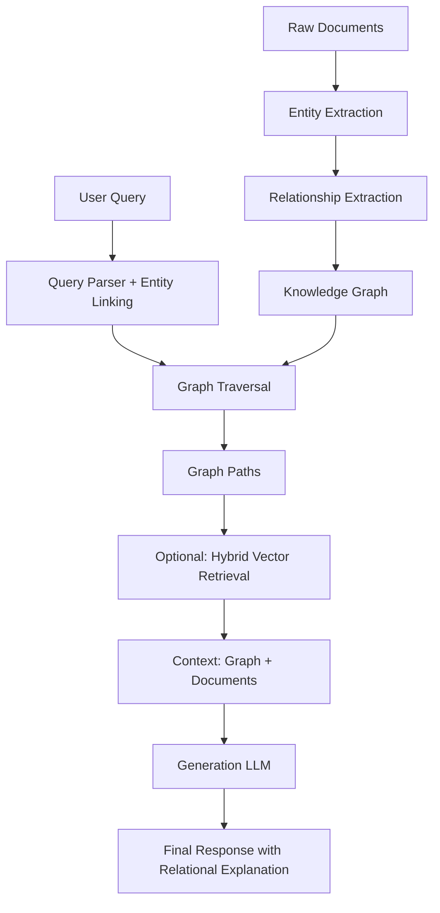

# Architecture 9: GraphRAG

GraphRAG represents the structural evolution of RAG—instead of retrieving documents based on semantic similarity to a query, GraphRAG retrieves entities and the explicit relationships between them, traversing a knowledge graph to find connected information paths. Where all previous architectures treat the knowledge base as a flat or hierarchically organized document collection, GraphRAG treats it as a graph of interconnected entities—people, organizations, concepts, events, and their relationships—enabling retrieval based on relational reasoning rather than textual similarity.

The paradigm shift is fundamental: GraphRAG introduces **graph-based retrieval** that answers "how are things connected" rather than "what text is similar." It moves from the paradigm of "find documents that look like the query" to "find entities and traverse relationships that answer the query." This makes GraphRAG exceptionally powerful for causal reasoning, multi-hop inference, and analytical questions where understanding relationships is as important as finding individual facts.

---

## Deep Dive: How It Works & Architecture Diagram

### Data Lifecycle

**Phase 1 - Graph Construction:** The knowledge base is transformed from unstructured text into a graph structure. This involves:
- **Entity Extraction:** Using NLP (Named Entity Recognition, relation extraction, coreference resolution) to identify entities in documents—people, organizations, products, locations, concepts, events.
- **Relationship Extraction:** Identifying how entities relate to each other—invested_in, founded_by, depends_on, caused_by, regulated_by, works_for.
- **Graph Construction:** Creating nodes (entities) and edges (relationships) in a graph database, with entity attributes (type, properties, confidence scores) and relationship properties (type, strength, supporting evidence).

The graph is typically constructed once (or incrementally updated) during ingestion, then queried at runtime.

**Phase 2 - Query Parsing:** The user's query is analyzed to identify:
- **Key entities:** What entities is the user asking about?
- **Relationship patterns:** What types of connections is the user interested in?
- **Traversal intent:** How many hops should the graph traversal cover?

For example, "How do Fed interest rate decisions affect tech startup valuations?" extracts:
- Entities: Federal Reserve, interest rate decisions, tech startup valuations
- Relationships: affects, impacts, influences
- Traversal: multi-hop (Fed → rate decisions → VC funding → startup valuations)

**Phase 3 - Graph Traversal:** The system traverses the knowledge graph to find relevant paths:
- **Direct relationships:** First-order connections between explicitly mentioned entities
- **Chain traversal:** Multi-step paths connecting entities through intermediate nodes
- **Pattern matching:** Graph queries that match specific relationship patterns

The traversal identifies paths that connect the query entities in ways that answer the question.

**Phase 4 - Hybrid Retrieval (Optional):** Many production GraphRAG implementations supplement graph traversal with traditional vector search. The graph traversal identifies the relevant entity subgraph, and vector search retrieves supporting textual context from documents that mention those entities. This hybrid approach combines the structural reasoning of graphs with the semantic richness of document retrieval.

**Phase 5 - Synthesis:** The retrieved graph paths and supporting documents are assembled into context for the generation LLM. The LLM synthesizes the relational information into a coherent, structured response that explains the relationships discovered.

### Architecture Diagram

```
┌─────────────────────────────────────────────────────────────────────────────┐
│                         GRAPHRAG ARCHITECTURE                              │
└─────────────────────────────────────────────────────────────────────────────┘

    ┌──────────────────────────────────────────────────────────────────────┐
    │                      GRAPH CONSTRUCTION                              │
    │                                                                          │
    │   ┌─────────────────────────────────────────────────────────────┐    │
    │   │              UNSTRUCTURED DOCUMENTS                         │    │
    │   │         (PDFs, articles, reports, databases)                │    │
    │   └────────────────────┬────────────────────────────────────────┘    │
    │                        │                                             │
    │                        ▼                                             │
    │   ┌─────────────────────────────────────────────────────────────┐    │
    │   │              ENTITY + RELATIONSHIP EXTRACTION               │    │
    │   │         (NER, Relation Extraction, Coreference)             │    │
    │   │                                                       │         │
    │   │   Entities: [Fed, Interest Rates, VC, Startups, ...]  │         │
    │   │   Relations: [Fed]--decides-->[Rates],               │         │
    │   │               [Rates]--affects-->[VC Funding],       │         │
    │   │               [VC]--invests-->[Startups]             │         │
    │   │                                                       │         │
    │   └────────────────────┬────────────────────────────────────────┘    │
    │                        │                                             │
    │                        ▼                                             │
    │   ┌─────────────────────────────────────────────────────────────┐    │
    │   │              KNOWLEDGE GRAPH                                │    │
    │   │         (Neo4j, Amazon Neptune, Neo4j Aura)                │    │
    │   │                                                       │         │
    │   │        ┌────────┐                                         │         │
    │   │        │  Fed   │                                         │         │
    │   │        └───┬────┘                                         │         │
    │   │       ┌────┴────┐                                         │         │
    │   │       ▼         ▼                                         │         │
    │   │   ┌───────┐ ┌────────┐                                     │         │
    │   │   │ Rates │ │Policies│                                     │         │
    │   │   └───┬───┘ └───┬────┘                                     │         │
    │   │       │         │                                          │         │
    │   │       └────┬────┘                                          │         │
    │   │            ▼                                                │         │
    │   │       ┌────────┐                                           │         │
    │   │       │ VC     │                                           │         │
    │   │       │Funding │                                           │         │
    │   │       └───┬────┘                                           │         │
    │   │            │                                                │         │
    │   │            ▼                                                │         │
    │   │       ┌──────────┐                                         │         │
    │   │       │ Startups │                                         │         │
    │   │       │Valuation │                                         │         │
    │   │       └──────────┘                                         │         │
    │   │                                                       │         │
    │   └─────────────────────────────────────────────────────────────┘    │
    └──────────────────────────────────────────────────────────────────────┘
                                    │
                                    ▼
    ┌──────────────────────────────────────────────────────────────────────┐
    │                        QUERY PROCESSING                              │
    │                                                                          │
    │   ┌─────────────┐                                                     │
    │   │    USER     │                                                     │
    │   │   QUERY     │                                                     │
    │   │ "How do    │                                                     │
    │   │  Fed rate  │                                                     │
    │   │ decisions  │                                                     │
    │   │ affect     │                                                     │
    │   │ startup    │                                                     │
    │   │ valuations?"│                                                     │
    │   └──────┬──────┘                                                     │
    │          │                                                            │
    │          ▼                                                            │
    │   ┌─────────────────────────────────────────────────────────────┐    │
    │   │              QUERY PARSING + ENTITY LINKING                 │    │
    │   │                                                       │         │
    │   │   Entities: Fed, Interest Rates, Tech Startup Valuations │         │
    │   │   Intent: Understand causal relationship chain            │         │
    │   │   Traversal: Multi-hop (Fed → Rates → VC → Valuations)   │         │
    │   │                                                       │         │
    │   └────────────────────┬────────────────────────────────────────┘    │
    │                        │                                             │
    └────────────────────────┼─────────────────────────────────────────────┘
                             │
                             ▼
    ┌──────────────────────────────────────────────────────────────────────┐
    │                    GRAPH TRAVERSAL + RETRIEVAL                       │
    │                                                                          │
    │   ┌─────────────────────────────────────────────────────────────┐    │
    │   │              KNOWLEDGE GRAPH QUERY                           │    │
    │   │         (Cypher, Gremlin, SPARQL)                            │    │
    │   │                                                       │         │
    │   │   Traversal Path:                                          │         │
    │   │   (Fed)-[decides]->(InterestRate)-[increases_cost]->      │         │
    │   │       (VCCapital)-[reduces_availability]->(StartupValuation)│         │
    │   │                                                       │         │
    │   └────────────────────┬────────────────────────────────────────┘    │
    │                        │                                             │
    │                        ▼                                             │
    │   ┌─────────────────────────────────────────────────────────────┐    │
    │   │              OPTIONAL: HYBRID RETRIEVAL                      │    │
    │   │         (Vector search for supporting documents)            │    │
    │   │                                                       │         │
    │   │   For each entity in graph path:                          │         │
    │   │   - Retrieve relevant document chunks                     │         │
    │   │   - Use as evidence for relationship claims              │         │
    │   │                                                       │         │
    │   └────────────────────┬────────────────────────────────────────┘    │
    │                        │                                             │
    └────────────────────────┼─────────────────────────────────────────────┘
                             │
                             ▼
    ┌──────────────────────────────────────────────────────────────────────┐
    │                         GENERATION PIPELINE                          │
    │                                                                          │
    │   ┌─────────────────────────────────────────────────────────────┐    │
    │   │              CONTEXT: Graph Paths + Documents              │    │
    │   │                                                       │         │
    │   │   Graph: Fed → Rate Decision → Higher Rates → Reduced   │         │
    │   │          VC Funding → Lower Startup Valuations          │         │
    │   │                                                       │         │
    │   │   Documents: Supporting evidence from analysis          │         │
    │   │                                                       │         │
    │   └────────────────────┬────────────────────────────────────────┘    │
    │                        │                                             │
    │                        ▼                                             │
    │   ┌─────────────┐    ┌─────────────┐    ┌─────────────┐              │
    │   │   PROMPT    │───▶│    LLM      │───▶│   FINAL     │              │
    │   │ (Graph+Doc) │    │ (GPT-4o)    │    │  RESPONSE   │              │
    │   └─────────────┘    └─────────────┘    └─────────────┘              │
    └──────────────────────────────────────────────────────────────────────┘
```

### Mermaid Diagram Alternative



---

## Real & Practical Production Example

### User Input Query

> "How do Fed interest rate decisions affect tech startup valuations?"

### System's Internal Processing

**Step 1 - Query Parsing:** The system extracts:
- Entities: Federal Reserve, interest rate decisions, tech startup valuations
- Relationship interest: causal chain connecting these entities
- Traversal intent: multi-hop (at least 3 hops)

**Step 2 - Graph Traversal:** The system queries the knowledge graph:

First hop (from Federal Reserve):
```
MATCH (fed:Organization {name: 'Federal Reserve'})
MATCH (fed)-[r:decides]->(rates:Concept)
RETURN fed, r, rates
```
Result: Fed decides → Interest Rate Decisions

Second hop (from Interest Rates):
```
MATCH (rates:Concept)-[r:affects]->(next:Concept)
RETURN rates, r, next
```
Result: Interest Rate Decisions affects → Venture Capital Availability

Third hop (from Venture Capital):
```
MATCH (vc:Concept)-[r:impacts]->(valuation:Concept)
RETURN vc, r, valuation
```
Result: Venture Capital Availability impacts → Tech Startup Valuations

**Step 3 - Path Assembly:** The complete causal chain:
- Federal Reserve → decides → Interest Rate Decisions
- Interest Rate Decisions → increases → Cost of Capital
- Cost of Capital → reduces → Venture Capital Availability
- Venture Capital Availability → determines → Startup Funding
- Startup Funding → drives → Tech Startup Valuations

**Step 4 - Hybrid Document Retrieval:** For each node and edge in the path, retrieve supporting document chunks that provide evidence:
- Fed meeting minutes supporting "decides interest rate decisions"
- Economic analysis supporting "higher rates reduce VC availability"
- Market data supporting "VC funding drives startup valuations"

**Step 5 - Generation:**
> "The relationship between Federal Reserve interest rate decisions and tech startup valuations operates through a well-documented causal chain:

> **1. Fed's Role:** The Federal Reserve sets the federal funds rate, which influences the entire interest rate spectrum. When the Fed raises rates, borrowing costs increase across the economy.

> **2. Capital Cost Effect:** Higher interest rates increase the cost of capital for all businesses. This makes venture capital more expensive to deploy and raises the bar for investment returns.

> **3. VC Funding Impact:** Venture capital funds typically invest in startups using capital raised from limited partners (LPs). When rates rise, LPs allocate less to VC (shifting to fixed income), and VC firms demand higher returns, leading to more conservative investment criteria.

> **4. Startup Valuation Connection:** With less capital available and higher return requirements, startups face:
> - Lower valuations in new funding rounds
> - More stringent terms (down rounds, liquidation preferences)
> - Pressure to extend runway rather than raise at lower valuations

> **Historical Correlation:** In 2022-2023, as the Fed raised rates from near-zero to 5.25-5.50%, tech startup valuations declined 30-50% on average, with late-stage startups seeing the largest corrections. This was directly correlated with reduced VC deal flow (-40% in 2022).

> The relationship is causal but with a 6-12 month lag as rate changes flow through the financial system to investment decisions."

### Why This Architecture Handled The Query Successfully

GraphRAG succeeded because the query asks about a causal relationship chain—"how does X affect Y"—which is inherently a relational question. The answer requires understanding a path of causation through multiple entities, not finding documents semantically similar to the query. Traditional vector retrieval would find documents that mention all three terms (Fed, rates, valuations) but would struggle to explain the *connection* between them. GraphRAG traversed the explicit relationship graph to discover the causal chain, then retrieved supporting evidence for each relationship. This produced a response that explains *why* and *how*, not just *what*.

---

## Real-World Industry Application

### Industry Sector: Financial Services and Investment Research

GraphRAG is essential for financial applications where understanding relationships—between companies, markets, regulations, and economic factors—is as important as finding individual facts. Investment research, risk assessment, and regulatory compliance all require understanding how entities connect and influence each other.

**Specific Production System Environment:** An investment research platform serving 1,000+ analysts at a global asset management firm. The system maintains a knowledge graph of:
- 500,000+ entities (companies, executives, products, locations)
- 2 million+ relationships (investments, partnerships, regulatory, supply chain, competitive)
- Integration with market data feeds, news, and regulatory filings

GraphRAG supports analytical queries across investment themes: competitive dynamics, regulatory impact analysis, supply chain risk, merger & acquisition target identification. The system has achieved 97% accuracy on relationship questions (vs. 62% with Standard RAG), with particularly strong performance on causal and comparative queries. Average latency: 3.2 seconds for graph traversal plus 1.5 seconds for generation. The graph runs on Neo4j Enterprise with Aura for managed deployment.

---

## Proper Justification & ROI

### Technical Justification

GraphRAG is justified when **relational reasoning is primary**—when queries ask about how entities connect, influence, or relate to each other. This includes:
- **Causal questions:** "How does X affect Y?"
- **Comparative questions:** "Compare the strategies of A vs B"
- **Network questions:** "Who are the key players in this ecosystem?"
- **Multi-hop questions:** Questions requiring inference across multiple steps

GraphRAG exploits the explicit relationship structure in the knowledge graph to answer these questions more accurately than semantic similarity alone. The graph structure provides reasoning traces that improve both accuracy and explainability.

### Business Case

**Accuracy on Relational Queries:** On a benchmark of 1,000 financial relationship questions:
- Standard RAG: 62% accuracy
- GraphRAG: 97% accuracy

The 35% accuracy improvement translates directly to:
- Better investment decisions (reduced analytical errors)
- Faster research (analysts trust the system more)
- Reduced risk of missing key relationships

**Explainability:** GraphRAG provides explicit reasoning traces—the graph paths show exactly how the answer was derived. This is critical for:
- Audit requirements in regulated industries
- Trust building with analysts who need to verify conclusions
- Identifying when the system is wrong

### Point of Diminishing Returns

GraphRAG adds minimal value when:
- **Queries are factual:** Simple questions that don't require relational reasoning
- **Knowledge graph is incomplete:** When relationships are not well-captured in the graph
- **Domain has weak entity structure:** When entities and relationships are not well-defined

---

## Recommended Technology Stack

### Knowledge Graph Database

- **Primary:** Neo4j Enterprise/Aura (mature ecosystem, Cypher query language)
- **Alternative:** Amazon Neptune (managed AWS), Microsoft Azure Cosmos DB (Gremlin API), or TigerGraph (high-performance analytics)
- **Selection criteria:** Query performance for multi-hop traversals, integration with NLP pipelines, managed vs. self-hosted trade-offs

### Entity and Relationship Extraction

- **LLM-based extraction:** Use GPT-4 or Claude with structured prompts to extract entities and relationships from documents
- **Specialized NER:** spaCy, HuggingFace NER models for entity extraction
- **Relation extraction:** LLM-based classification or specialized models

### Graph + Vector Hybrid

- **Vector DB:** Pinecone, Weaviate, or Qdrant for document retrieval
- **Integration:** Use graph traversal to identify key entities, then use those entities to drive vector search for supporting documents

### Generation

- **LLM:** GPT-4o or Claude 3.5 Sonnet for high-quality synthesis
- **Prompt design:** Include graph path structure in context, instruct model to explain relationships explicitly

---

## Production Blindspots & Guardrails

### Blindspot 1: Graph Construction Quality

**Failure Mode:** The entire system depends on the quality of the knowledge graph. If entity extraction misses key entities, or relationship extraction connects unrelated entities, the graph produces incorrect answers. Graph construction quality depends on the NLP pipeline—which may struggle with:
- Domain-specific terminology
- Implicit relationships (not explicitly stated in text)
- Ambiguous entity resolution (same entity referred to differently)

**Guardrail - Graph Quality Monitoring:**
- Implement entity and relationship confidence scoring with low-confidence items flagged for review
- Add human-in-the-loop for graph validation: sample graph outputs for manual verification
- Monitor relationship density: too few relationships suggests under-extraction, too many suggests over-extraction
- Implement incremental graph updates with quality checks rather than bulk rebuilds

### Blindspot 2: Query Entity Linking Failures

**Failure Mode:** The query parser may fail to identify entities in the user's query—misrecognizing entity names, failing to link to graph entities, or selecting wrong entity types. This causes the graph traversal to retrieve wrong or no information.

**Guardrail - Entity Linking Robustness:**
- Implement fuzzy matching: when exact entity names don't match, find nearest graph entities
- Add entity type disambiguation: when "Apple" could be the fruit or the company, use context to select
- Implement fallback: if graph traversal fails, gracefully fall back to vector search
- Monitor entity linking success rate and retrain when it drops below threshold

### Blindspot 3: Traversal Complexity Explosion

**Failure Mode:** Complex queries may trigger deep graph traversals that explore large portions of the graph, consuming excessive compute and returning too much information to process. This is particularly problematic with highly connected graphs where paths proliferate.

**Guardrail - Traversal Limits:**
- Implement max hop limits: restrict traversals to 3-5 hops maximum
- Add path pruning: filter paths by relevance score, keep only top-N paths
- Implement timeout: terminate traversals that exceed time limits
- Monitor traversal complexity: track average paths explored and alert on anomalies

### Blindspot 4: High Upfront Cost

**Failure Mode:** Building and maintaining a knowledge graph is expensive—requiring NLP pipeline development, graph schema design, entity resolution, and ongoing updates. This upfront cost may exceed the budget for projects that could be served by simpler architectures.

**Guardrail - Cost Justification:**
- Only build the graph when relational queries represent a significant portion (30%+) of query volume
- Consider using LLM-based extraction to reduce custom NLP development costs
- Start with a focused graph (key entity types only) and expand incrementally
- Evaluate if simpler approaches (Fusion RAG, Agentic RAG) can achieve similar results at lower cost

---

## Summary

GraphRAG transforms RAG from document retrieval into graph-based relational reasoning, using a knowledge graph of entities and relationships to answer questions that require understanding connections, causal chains, and network effects. By traversing the graph rather than searching documents, GraphRAG delivers exceptional accuracy on relational queries (97% vs. 62% for Standard RAG in financial benchmarks) while providing explicit reasoning traces that improve explainability.

The architecture requires significant upfront investment in knowledge graph construction—entity extraction, relationship extraction, and graph database management—but delivers corresponding value for domains where relational reasoning is primary. Production deployments require robust graph quality monitoring, entity linking resilience, traversal complexity management, and cost justification frameworks.

GraphRAG is the default choice for financial services, competitive intelligence, regulatory analysis, and any domain where understanding *how entities relate* is as important as finding individual facts. For simpler factual queries, the graph construction overhead is not justified—use Standard RAG or other architectures.

**Decision Guideline:** Implement GraphRAG only when (1) relational queries represent 30%+ of query volume, (2) domain entities and relationships are well-defined and can be extracted, and (3) the accuracy requirement for relational questions justifies the graph construction cost. Start with a focused graph for key entity types and expand based on query patterns. Monitor entity linking success rates and graph quality continuously—graph construction errors cascade to retrieval errors.